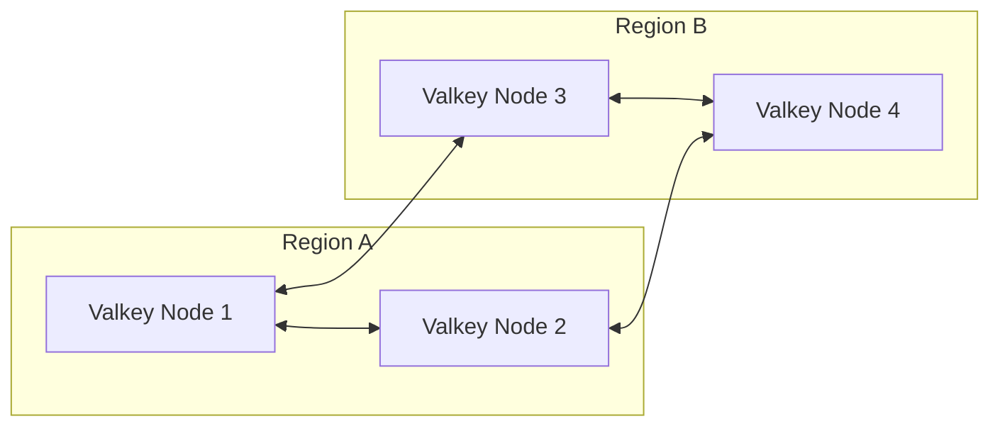

# 12-Valkey-Redis Specialist Role Documentation

---

## Overview

This comprehensive documentation is designed for the **12-Valkey-Redis Specialist** role, providing an in-depth exploration of the core and advanced Redis concepts, including data structures, persistence mechanisms, replication strategies, Sentinel high-availability, clustering, pub/sub messaging, streams, and the unique features and enhancements introduced by the Valkey fork. Additionally, it covers migration methodologies and best practices essential for managing and optimizing Redis deployments at an enterprise level.

Redis, an open-source, in-memory data structure store, is widely adopted for its performance, flexibility, and rich data model. The 12-Valkey-Redis Specialist role demands mastery over Redis internals, operational expertise, and the ability to leverage the Valkey fork’s specialized capabilities to architect scalable, resilient, and efficient data solutions.

---

> **Note:** For an even more granular analysis of Valkey-specific features, advanced cluster tuning, and migration strategies, please refer to the accompanying **Advanced 12-Valkey-Redis Specialist Documentation**.

---

## Table of Contents

1. Redis Data Structures  
2. Persistence Mechanisms: RDB and AOF  
3. Replication Architecture  
4. High Availability with Sentinel  
5. Redis Cluster Architecture  
6. Pub/Sub Messaging Model  
7. Redis Streams  
8. Valkey Fork: Enhancements and Differences  
9. Migration Strategies to/from Valkey-Redis  
10. Best Practices and Operational Insights  

---

## 1. Redis Data Structures

Redis is not merely a key-value store; it supports a variety of complex data structures, enabling sophisticated use cases ranging from caching to real-time analytics.

### Core Data Structures

Redis supports the following fundamental data types, each optimized for specific access patterns and memory efficiencies:

| Data Type | Description | Use Cases | Commands (Key Examples) |
|-----------|-------------|-----------|------------------------|
| String    | Binary-safe strings up to 512MB | Caching, counters, tokens | `SET`, `GET`, `INCR`, `APPEND` |
| Hashes    | A collection of field-value pairs | Storing objects, user profiles | `HSET`, `HGET`, `HGETALL` |
| Lists     | Linked lists, ordered sequences | Queues, timelines | `LPUSH`, `RPUSH`, `LPOP`, `LRANGE` |
| Sets      | Unordered collections of unique elements | Tagging, unique visitor tracking | `SADD`, `SREM`, `SMEMBERS` |
| Sorted Sets (ZSets) | Sets ordered by a score (float) | Leaderboards, priority queues | `ZADD`, `ZRANGE`, `ZREM` |
| Bitmaps   | Strings interpreted as bit arrays | Flags, presence tracking | `SETBIT`, `GETBIT` |
| HyperLogLog | Probabilistic data structure for cardinality estimation | Unique counts with low memory footprint | `PFADD`, `PFCOUNT` |
| Geospatial | Stores geospatial indexes | Location-based queries | `GEOADD`, `GEORADIUS` |
| Streams   | Append-only log data structure | Event sourcing, messaging | `XADD`, `XREAD`, `XGROUP` |

### Deep Dive: Hashes and Memory Optimization

Hashes are a particularly memory-efficient way to represent objects. Redis optimizes small hashes internally using a special encoding called **ziplist**, which stores multiple field-value pairs in contiguous memory. This reduces the overhead of individual small objects.

```bash
127.0.0.1:6379> HSET user:1000 name "Alice" age "30" city "Seattle"
(integer) 3
127.0.0.1:6379> HGETALL user:1000
1) "name"
2) "Alice"
3) "age"
4) "30"
5) "city"
6) "Seattle"
```

---

## 2. Persistence Mechanisms: RDB and AOF

Redis supports two primary persistence modes to ensure durability beyond its in-memory state: **RDB (Redis Database File)** snapshots and **AOF (Append Only File)** logging.

### RDB Persistence

RDB snapshots create point-in-time snapshots of the dataset at specified intervals.

- **Mechanism:** Forks the Redis process and serializes the in-memory data to disk.
- **Configuration:** Controlled by the `save` directive in `redis.conf`. Example:
  
  ```conf
  save 900 1     # Save if at least 1 key changed in 900 seconds
  save 300 10
  save 60 10000
  ```

- **Pros:** Fast restarts, compact files, minimal runtime overhead.
- **Cons:** Potential data loss between snapshots, fork overhead.

### AOF Persistence

AOF logs every write command received by the server, replaying them on restart.

- **Mechanism:** Commands are appended to a log file asynchronously.
- **Configuration:**

  ```conf
  appendonly yes
  appendfsync everysec
  ```

- **Rewrite:** A background process compacts the AOF file to remove redundant commands.
- **Pros:** Fine-grained durability, minimal data loss.
- **Cons:** Larger files, slower startup than RDB.

### Hybrid Approach

Redis allows enabling both persistence methods simultaneously — RDB snapshots for faster restarts and AOF for durability.

### Valkey Fork Enhancements

The Valkey fork introduces incremental snapshotting and improved AOF rewriting algorithms, reducing fork overhead on large datasets significantly. It also supports configurable persistence tiers allowing selective persistence of specific keyspaces.

---

## 3. Replication Architecture

Redis replication is a fundamental architecture for scaling reads and supporting high availability.

### Master-Slave Model

- **Asynchronous Replication:** Slaves replicate data asynchronously from the master.
- **Replication Process:**
  1. On connection, the slave sends a PSYNC command.
  2. Master sends a full resync snapshot (RDB dump).
  3. Slave continues receiving incremental commands.

### Configuration Example

```conf
# On slave:
replicaof 192.168.1.100 6379
```

### Cascading Replication

Slaves can themselves have slaves, forming a replication tree to distribute load.

### Handling Failover

Replication alone does not guarantee failover; this is handled by **Sentinel** (discussed later).

### Valkey Fork Replication Enhancements

Valkey introduces **multi-master replication** with automatic conflict resolution through vector clocks, enabling more complex distributed topologies and geo-replication use cases.

---

## 4. High Availability with Sentinel

Redis Sentinel provides monitoring, notification, and automatic failover to maintain high availability.

### Sentinel Architecture

- **Monitoring:** Sentinels monitor master and slave instances.
- **Failover:** Detects master failure and promotes a slave.
- **Notification:** Clients and applications can be notified of topology changes.

### Sentinel Workflow

1. Sentinels ping masters and slaves periodically.
2. On master failure detection, Sentinels reach consensus.
3. A slave is promoted to master.
4. Other slaves are reconfigured to replicate the new master.
5. Clients can query Sentinel for updated master address.

### Sentinel Configuration Example

```conf
sentinel monitor mymaster 192.168.1.100 6379 2
sentinel down-after-milliseconds mymaster 5000
sentinel failover-timeout mymaster 60000
sentinel parallel-syncs mymaster 1
```

### Best Practices

- Run at least 3 Sentinels for quorum.
- Deploy Sentinels on separate nodes from Redis servers.
- Use Redis clients with Sentinel support for automatic failover handling.

### Valkey Sentinel Features

Valkey extends Sentinel with multi-region failover and enhanced consensus algorithms, reducing failover time and improving resilience in WAN deployments.

---

## 5. Redis Cluster Architecture

Redis Cluster provides a native sharding and high availability solution.

### Cluster Basics

- **Data Partitioning:** The keyspace is divided into 16,384 hash slots.
- **Nodes:** Each node holds a subset of hash slots.
- **Replication:** Each primary node has one or more replicas.
- **Automatic Failover:** Cluster detects node failures and promotes replicas.

### Cluster Communication

Nodes communicate via the **Gossip Protocol** to share cluster state.

### Key Hashing

Keys are hashed to assign to slots:

```bash
SLOT = CRC16(key) mod 16384
```

### Client Behavior

Clients must be cluster-aware to redirect commands to the correct node.

### Cluster Setup Example

```bash
redis-cli --cluster create 192.168.1.100:7000 192.168.1.101:7000 192.168.1.102:7000 --cluster-replicas 1
```

### Slot Migration Procedure

When adding/removing nodes, slots are migrated incrementally using `CLUSTER SETSLOT` and `MIGRATE` commands to ensure minimal downtime.

### Valkey Cluster Fork Features

The Valkey fork enhances cluster support by supporting **flexible slot sizes**, **dynamic slot rebalancing**, and **multi-dimensional sharding** (e.g., by key and by data attribute), enabling more granular control over data distribution.

---

## 6. Pub/Sub Messaging Model

Redis Pub/Sub is a lightweight messaging paradigm supporting real-time communication.

### Basic Concepts

- **Publishers:** Send messages to channels.
- **Subscribers:** Receive messages from channels they subscribe to.

### Commands

```bash
SUBSCRIBE channel1 channel2
PUBLISH channel1 "Hello World"
```

### Use Cases

- Real-time notifications
- Chat applications
- Event broadcasting

### Limitations

- No message persistence or delivery guarantees.
- Subscribers must be online to receive messages.

### Redis Streams as a Durable Alternative

For persistent, reliable message queues, Redis Streams are recommended.

---

## 7. Redis Streams

Redis Streams provide a log-based, persistent, and distributed data structure for event streaming.

### Stream Data Structure

- Append-only log of messages with IDs.
- Messages are key-value pairs.
- Supports consumer groups for load balancing.

### Core Commands

- `XADD`: Add a message.
- `XREAD`: Read messages.
- `XGROUP CREATE`: Create consumer groups.
- `XREADGROUP`: Read messages in a consumer group.

### Example: Appending and Reading

```bash
XADD mystream * user_id 123 action login
XREAD COUNT 2 STREAMS mystream 0
```

### Consumer Group Example

```bash
XGROUP CREATE mystream mygroup 0
XREADGROUP GROUP mygroup Alice STREAMS mystream >
```

### Use Cases

- Event sourcing
- Task queues
- Real-time data processing pipelines

### Valkey Streams Enhancements

Valkey implements **distributed streams** allowing stream data to be partitioned across nodes with global ordering guarantees and supports **stream compaction** for long-lived streams.

---

## 8. Valkey Fork: Enhancements and Differences

The 12-Valkey-Redis fork is a specialized Redis implementation with enhancements focused on scalability, multi-region operation, and operational efficiency.

### Key Enhancements

| Feature | Description | Benefits |
|---------|-------------|----------|
| Multi-Master Replication | Allows writes on any node with vector clock conflict resolution | Geo-distributed writes, reduces master bottlenecks |
| Incremental Snapshots | Partial RDB dumps for reduced disk I/O and latency | Faster persistence on large datasets |
| Dynamic Slot Sharding | Adjustable hash slot sizes and multi-dimensional sharding | More efficient data distribution |
| Selective Persistence | Allows keyspace-level persistence policies | Optimizes storage and durability |
| Enhanced Failover | Multi-region, consensus-based failovers | Reduced downtime and split-brain prevention |
| Distributed Streams | Partitioned streams with global ordering | Scalable event processing pipelines |

### Architecture Pattern

Valkey nodes form a **mesh network**, with multi-master replication enabling active-active deployments across geographical regions. Conflict resolution and data consistency are maintained through vector clocks and causal ordering.



---

## 9. Migration Strategies to/from Valkey-Redis

Migrating existing Redis deployments to Valkey-Redis or vice versa requires careful planning due to differences in replication models and data management.

### Migration Approaches

1. **Data Export/Import**

   - Use `DUMP` and `RESTORE` commands or `redis-cli --rdb` snapshot export.
   - Validate data integrity post-import.

2. **Live Replication Setup**

   - Establish Valkey nodes as replicas of existing Redis masters.
   - Gradually promote Valkey nodes to primary and redirect clients.

3. **Dual Writes**

   - Modify application logic to write to both Redis and Valkey during transition.
   - Synchronize and validate data consistency.

### Challenges

- Conflict resolution differences: Valkey’s multi-master model necessitates application awareness of eventual consistency.
- Feature parity: Some Valkey features may require client or application changes (e.g., multi-dimensional sharding).

### Best Practices

- Perform staged migrations with extensive testing.
- Use monitoring to detect anomalies during migration.
- Maintain fallback procedures to revert if necessary.

---

## 10. Best Practices and Operational Insights

### Performance Optimization

- Use pipelining to batch commands and reduce RTT.
- Prefer hashes and ziplists for memory-efficient storage.
- Monitor memory fragmentation and tune allocator settings.

### Monitoring and Alerting

- Use Redis INFO command and Sentinel monitoring.
- Employ tools like Redis Enterprise, Prometheus exporters.
- Track key metrics: latency, memory usage, eviction rates.

### Security

- Enable ACLs for granular access control.
- Use TLS encryption for client-server communication.
- Restrict Redis access to trusted networks.

### Backup and Disaster Recovery

- Schedule regular RDB snapshots.
- Use AOF with appendfsync set to everysec for durability.
- Test restore procedures periodically.

### Scaling Recommendations

- Use Redis Cluster for horizontal scaling.
- Leverage Valkey multi-master for geo-distributed writes.
- Partition workloads by data type or usage pattern.

---

# Code Example: Setting Up a Simple Valkey-Redis Cluster with Persistence

```bash
# Start Valkey Redis nodes with persistence enabled
valkey-redis-server --port 7000 --appendonly yes --save "900 1" --cluster-enabled yes --cluster-config-file nodes-7000.conf --cluster-node-timeout 5000 &
valkey-redis-server --port 7001 --appendonly yes --save "900 1" --cluster-enabled yes --cluster-config-file nodes-7001.conf --cluster-node-timeout 5000 &

# Create the cluster
valkey-redis-cli --cluster create 127.0.0.1:7000 127.0.0.1:7001 --cluster-replicas 0

# Verify cluster info
valkey-redis-cli -p 7000 cluster info

# Add data
valkey-redis-cli -p 7000 SET user:1000:name "Alice"
```

---

# Summary

The 12-Valkey-Redis Specialist role requires comprehensive expertise spanning core Redis data structures, persistence, replication, high availability, clustering, messaging, and streams, augmented by the advanced capabilities introduced by the Valkey fork. Mastery over these topics enables the design, deployment, and operation of high-performance, fault-tolerant, and scalable Redis environments essential for modern data-driven applications.

---

> For deeper exploration of Valkey cluster internals, advanced migration workflows, and detailed performance tuning, please consult the **Advanced 12-Valkey-Redis Specialist Documentation**.

---

*End of Document*