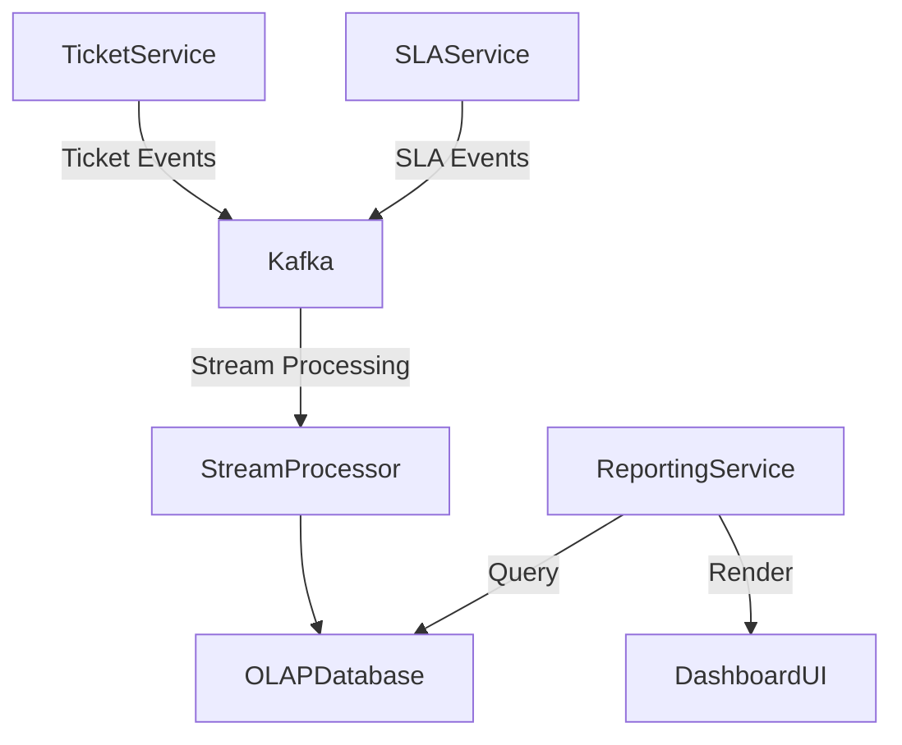

# Ticket System Supreme Specialist Guide

---

## Table of Contents
1. [Introduction](#introduction)  
2. [Core Architecture](#core-architecture)  
    2.1 [Microservices Architecture](#microservices-architecture)  
    2.2 [Database Schema Design](#database-schema-design)  
    2.3 [Message Queues and Event-Driven Communication](#message-queues-and-event-driven-communication)  
3. [Data Model & Ticket Fields](#data-model--ticket-fields)  
    3.1 [Standard Fields](#standard-fields)  
    3.2 [Custom Fields and Extensibility](#custom-fields-and-extensibility)  
    3.3 [System Fields and Metadata](#system-fields-and-metadata)  
4. [State Machine & Workflow States](#state-machine--workflow-states)  
5. [ITIL Priority Matrix](#itil-priority-matrix)  
6. [SLA Management Plan](#sla-management-plan)  
7. [Filter & Search Engine](#filter--search-engine)  
8. [Graphics & Dashboard Plan](#graphics--dashboard-plan)  
9. [Automation & Routing Rules](#automation--routing-rules)  
10. [Conclusion & Next Steps](#conclusion--next-steps)  

---

## Introduction

The ticketing system is the backbone of effective customer service and IT support. Crafting an enterprise-grade ticket system demands a deep understanding of the core architecture, data modeling, workflows, and service-level agreements (SLAs). This guide serves as the ultimate blueprint to design and implement a state-of-the-art ticketing system inspired by industry leaders such as Zendesk, Jira Service Management, Freshdesk, ServiceNow, and Linear.

This document is written for software architects, developers, and product managers aiming to build a scalable, extensible, and maintainable ticketing platform. It covers every essential aspect, from microservices architecture to SLA enforcement and advanced search capabilities. For additional advanced configurations and integrations, please refer to the **Advanced Ticket System Supreme Specialist Guide**.

---

## Core Architecture

### Microservices Architecture

Modern ticketing systems demand scalability, maintainability, and resilience. Implementing a microservices architecture allows decoupling of core functionalities into independently deployable services. This architecture caters to the high volume and complexity of enterprise ticketing.

#### Key Microservices Components:
- **Ticket Service:** Manages ticket lifecycle, states, and data persistence.
- **User Service:** Handles user profiles, roles, permissions, and authentication.
- **Notification Service:** Sends email, SMS, and push notifications.
- **SLA Service:** Tracks SLA timers, escalations, and compliance metrics.
- **Search Service:** Provides ticket search capabilities, indexing, and filters.
- **Automation Service:** Executes routing rules, triggers workflow automation.
- **Reporting & Dashboard Service:** Aggregates KPIs and metrics for visualization.

Each microservice exposes RESTful APIs or gRPC endpoints, enabling interoperability through service discovery (e.g., via Consul or Kubernetes DNS).

#### Deployment Pattern

Deploy microservices in Kubernetes clusters with horizontal pod autoscaling based on CPU/Memory and request rates. Use API gateways to centralize authentication, rate limiting, and routing.

| Microservice          | Responsibility                                  | Data Store                  | Protocol          |
|----------------------|------------------------------------------------|-----------------------------|-------------------|
| Ticket Service       | Ticket CRUD, lifecycle management               | Relational DB (PostgreSQL)   | REST/gRPC         |
| User Service         | User profiles, roles, authentication            | NoSQL (MongoDB/Redis)        | REST/gRPC         |
| Notification Service | Email, SMS, push notification dispatch          | Message Queue (Kafka/RabbitMQ)| REST/Message Bus  |
| SLA Service          | SLA clock management, escalations                | Time-series DB (InfluxDB)    | REST/gRPC         |
| Search Service       | Full-text search, filters                         | Elasticsearch/OpenSearch     | REST              |
| Automation Service   | Rule engine, workflow triggers                    | Relational DB + Redis Cache  | REST/gRPC         |
| Reporting Service    | KPI dashboards, analytics                          | OLAP DB (ClickHouse/Redshift)| REST              |

### Database Schema Design

A hybrid database approach combines the strengths of relational and NoSQL databases. The core ticket and workflow data reside in an ACID-compliant relational database (PostgreSQL), ensuring transactional integrity. User sessions, caching, and ephemeral data utilize Redis. Search indexes are maintained in Elasticsearch.

#### Core Ticket Table Schema (PostgreSQL example):

```sql
CREATE TABLE tickets (
    ticket_id SERIAL PRIMARY KEY,
    title VARCHAR(255) NOT NULL,
    description TEXT,
    status VARCHAR(50) NOT NULL,
    priority VARCHAR(50),
    impact VARCHAR(50),
    urgency VARCHAR(50),
    sla_deadline TIMESTAMPTZ,
    created_at TIMESTAMPTZ DEFAULT NOW(),
    updated_at TIMESTAMPTZ DEFAULT NOW(),
    created_by UUID REFERENCES users(user_id),
    assigned_to UUID REFERENCES users(user_id),
    category VARCHAR(100),
    service_level_agreement_id INT,
    custom_fields JSONB,
    metadata JSONB
);

CREATE INDEX idx_ticket_status ON tickets(status);
CREATE INDEX idx_ticket_priority ON tickets(priority);
CREATE INDEX idx_ticket_sla_deadline ON tickets(sla_deadline);
```

This schema allows extensibility through `custom_fields` and `metadata` columns storing JSONB data. The separation of user data into a dedicated `users` table maintains normalized relationships.

### Message Queues and Event-Driven Communication

An event-driven architecture facilitates asynchronous processing, decoupling producers and consumers. Kafka or RabbitMQ serve as message brokers, enabling reliable delivery of events such as ticket updates, SLA breaches, or notifications.

**Event Flow Example:**  
When a ticket status changes from "Pending" to "Solved," the Ticket Service emits a `TicketStatusChanged` event. The SLA Service listens and updates SLA timers. The Notification Service triggers emails to stakeholders.

```json
{
  "eventType": "TicketStatusChanged",
  "timestamp": "2024-06-01T10:15:30Z",
  "ticketId": 12345,
  "oldStatus": "Pending",
  "newStatus": "Solved",
  "changedBy": "user-uuid-789"
}
```

Using event sourcing and CQRS (Command Query Responsibility Segregation) patterns improves system scalability and auditability.

---

## Data Model & Ticket Fields

### Standard Fields

Standard fields constitute the backbone of any ticket system, ensuring consistent tracking of important ticket attributes. These fields should support various ticket types (incident, service request, change request).

| Field Name      | Type           | Description                                    | Example                   |
|-----------------|----------------|------------------------------------------------|---------------------------|
| Ticket ID       | UUID/Integer   | Unique identifier for the ticket                | 1001                      |
| Title           | String         | Brief summary of the ticket                      | "Cannot access VPN"       |
| Description     | Text           | Detailed description of the problem/request     | "User unable to connect to VPN after password reset" |
| Status          | Enum           | Current state of the ticket                       | New, Open, Pending, Closed|
| Priority        | Enum           | Importance of ticket                              | Low, Medium, High, Urgent |
| Impact          | Enum           | Scope of effect (individual, department, org)   | User, Department, Organization |
| Urgency         | Enum           | Speed required for resolution                     | Low, Medium, High         |
| Category        | String         | Classification of ticket                          | Network, Hardware, Software|
| Created At      | Timestamp      | Creation time of ticket                           | 2024-06-01 09:00:00       |
| Updated At      | Timestamp      | Last update time                                 | 2024-06-01 10:00:00       |
| Created By      | UUID           | User who created the ticket                       | user-uuid-001             |
| Assigned To     | UUID           | User/team assigned for resolution                 | user-uuid-002             |
| SLA Deadline    | Timestamp      | Service deadline for ticket resolution            | 2024-06-02 09:00:00       |

### Custom Fields and Extensibility

Enterprise clients often require custom fields to capture domain-specific data. The system must allow administrators to define custom fields dynamically, including field types (text, dropdown, date, boolean), validation rules, and visibility.

Custom fields are stored in a flexible JSONB column to avoid schema migrations. For example:

```json
{
  "custom_fields": {
    "device_type": "Laptop",
    "operating_system": "Windows 10",
    "purchase_date": "2023-12-15"
  }
}
```

Custom field definitions are stored in a separate metadata table:

```sql
CREATE TABLE custom_field_definitions (
    id SERIAL PRIMARY KEY,
    name VARCHAR(100) NOT NULL,
    field_type VARCHAR(50) NOT NULL,
    required BOOLEAN DEFAULT FALSE,
    options JSONB,
    visibility_rules JSONB,
    created_at TIMESTAMPTZ DEFAULT NOW()
);
```

### System Fields and Metadata

System fields are managed by the backend and include audit data and internal flags:

- **CreatedAt / UpdatedAt:** Timestamps for audit trails.
- **DeletedAt:** Soft delete marker.
- **Version:** For optimistic locking.
- **Tags:** Array of labels for easy categorization.
- **Metadata:** JSON containing auxiliary information such as source system, channel (email, chat), or external references.

---

## State Machine & Workflow States

Ticket state management is critical to reflect accurately the ticket lifecycle. State machines enforce valid transitions and trigger actions.

### Recommended Workflow States

| State     | Description                                                      | Allowed Transitions                    |
|-----------|------------------------------------------------------------------|--------------------------------------|
| New       | Ticket just created, unassigned                                  | New → Open, New → Closed              |
| Open      | Actively worked on by agent/team                                | Open → Pending, Open → On-Hold, Open → Solved |
| Pending   | Waiting for customer response                                   | Pending → Open, Pending → On-Hold    |
| On-Hold   | Delayed due to external dependencies                            | On-Hold → Open, On-Hold → Closed     |
| Solved    | Solution provided, awaiting closure confirmation                | Solved → Closed, Solved → Reopened   |
| Closed    | Ticket closed, no further action required                       | Closed → Reopened                    |
| Reopened  | Ticket reopened after closure                                   | Reopened → Open                      |

### State Transition Diagram

```mermaid
stateDiagram-v2
    [*] --> New
    New --> Open
    New --> Closed
    Open --> Pending
    Open --> On-Hold
    Open --> Solved
    Pending --> Open
    Pending --> On-Hold
    On-Hold --> Open
    On-Hold --> Closed
    Solved --> Closed
    Solved --> Reopened
    Closed --> Reopened
    Reopened --> Open
```

### Implementation Considerations

Transitions must be validated in business logic and enforced via APIs. Each state change triggers event emissions and SLA recalculations. The system should support configurable workflows per ticket category or customer segment.

---

## ITIL Priority Matrix

The ITIL framework suggests prioritizing tickets based on *Impact* and *Urgency*. This matrix determines the priority and corresponding response/resolution times.

### Impact vs Urgency Matrix

| Impact \ Urgency | Low Urgency              | Medium Urgency           | High Urgency             |
|------------------|--------------------------|-------------------------|--------------------------|
| Low Impact       | Priority 4 - Low          | Priority 3 - Medium      | Priority 2 - High         |
| Medium Impact    | Priority 3 - Medium       | Priority 2 - High        | Priority 1 - Critical     |
| High Impact      | Priority 2 - High         | Priority 1 - Critical    | Priority 1 - Critical     |

### Priority Levels and Definitions

| Priority   | Description                          | Response Time (Business Hours) | Resolution Time (Business Hours) |
|------------|------------------------------------|-------------------------------|----------------------------------|
| Critical   | Severe impact, affects business-critical functions | 15 minutes                     | 2 hours                         |
| High       | Significant impact, affects multiple users         | 30 minutes                     | 4 hours                         |
| Medium     | Moderate impact, single user affected               | 1 hour                        | 8 hours                         |
| Low        | Minor impact, no significant disruption             | 4 hours                       | 24 hours                        |

### Priority Calculation Algorithm (Pseudo-code)

```python
def calculate_priority(impact: str, urgency: str) -> str:
    priority_map = {
        ('Low', 'Low'): 'Low',
        ('Low', 'Medium'): 'Medium',
        ('Low', 'High'): 'High',
        ('Medium', 'Low'): 'Medium',
        ('Medium', 'Medium'): 'High',
        ('Medium', 'High'): 'Critical',
        ('High', 'Low'): 'High',
        ('High', 'Medium'): 'Critical',
        ('High', 'High'): 'Critical',
    }
    return priority_map.get((impact, urgency), 'Low')
```

The system automatically assigns priority on ticket creation and updates.

---

## SLA Management Plan

SLA management ensures service commitments are met. This involves monitoring multiple SLA metrics, timers, and escalations.

### SLA Types

- **First Response Time:** Maximum time allowed to provide the initial response.
- **Every Response Time:** Time between consecutive responses or updates.
- **Resolution Time:** Maximum time to resolve and close the ticket.
- **Escalation Time:** Time after which ticket escalates if not acted upon.

### SLA Timers and Business Hours

SLAs should respect working calendars (business hours vs calendar hours). Business hours exclude weekends, holidays, and off-hours.

| SLA Parameter           | Description                                  | Example Value              |
|------------------------|----------------------------------------------|----------------------------|
| Business Hours         | Working hours considered for SLA calculations | Mon-Fri, 9 AM – 5 PM       |
| Calendar Hours         | Continuous 24/7 hours                        | 24/7                      |
| Holiday Calendar       | List of holiday dates to exclude             | Jan 1, Dec 25             |

### SLA Enforcement Architecture

- SLA timers are managed by the SLA Service, which subscribes to ticket lifecycle events.
- Timers pause during off-business hours.
- On SLA breaches, escalation events are emitted, triggering notifications or higher-level alerts.
- SLA status is updated in ticket metadata for visibility.

### SLA Configuration Example (YAML)

```yaml
sla_policies:
  - id: 1
    name: "Standard Support"
    business_hours:
      timezone: "America/New_York"
      working_days: [1,2,3,4,5]  # Monday to Friday
      working_hours:
        start: "09:00"
        end: "17:00"
      holidays: ["2024-01-01", "2024-12-25"]
    first_response_time: "0h15m"
    every_response_time: "4h"
    resolution_time: "8h"
    escalation_rules:
      - after: "0h15m"
        action: "Notify Tier 1 Support"
      - after: "4h"
        action: "Escalate to Tier 2"
      - after: "8h"
        action: "Notify Management"
```

### SLA Monitoring & Alerts

Dashboards visualize SLA compliance ratios, breached tickets, and average response times. Automated alerting ensures proactive management.

---

## Filter & Search Engine

Robust filtering and search capabilities are crucial for agents to locate tickets swiftly.

### Search Engine Choice

Elasticsearch or its open-source fork OpenSearch is the standard for full-text search and complex querying. It supports near real-time indexing and advanced aggregations.

### Data Indexed

- Ticket fields: title, description, status, priority, category.
- User fields: requester name, assigned agent.
- Custom fields (flattened as needed).
- Metadata tags.
- Comments and activity logs (optional).

### Query Parameters

Search APIs accept a rich set of filters:

| Parameter          | Type        | Description                                    | Example                          |
|--------------------|-------------|------------------------------------------------|----------------------------------|
| status             | Enum/List   | Filter by ticket status                         | status=Open,Pending              |
| priority           | Enum/List   | Filter by priority                              | priority=High                   |
| assigned_to        | UUID        | Tickets assigned to a specific user            | assigned_to=user-uuid-123       |
| created_by         | UUID        | Tickets created by a user                       | created_by=user-uuid-456        |
| created_at_range   | Date Range  | Tickets created within a date range             | created_at=2024-01-01..2024-06-01 |
| full_text          | String      | Full-text search on title/description           | full_text="VPN connection issue" |

### Sample Elasticsearch Query (DSL)

```json
{
  "query": {
    "bool": {
      "must": [
        {
          "multi_match": {
            "query": "VPN connection issue",
            "fields": ["title^3", "description"]
          }
        },
        {
          "terms": {
            "status": ["Open", "Pending"]
          }
        }
      ],
      "filter": [
        {
          "range": {
            "created_at": {
              "gte": "2024-01-01T00:00:00",
              "lte": "2024-06-01T23:59:59"
            }
          }
        }
      ]
    }
  },
  "sort": [
    {"priority": {"order": "desc"}},
    {"created_at": {"order": "asc"}}
  ]
}
```

### Faceted Search and Aggregations

To enable quick filtering by category, SLA status, or agents, aggregations and facets are indexed and queried.

---

## Graphics & Dashboard Plan

Visualizing ticket metrics and KPIs allows service managers to monitor performance and identify bottlenecks.

### Core KPIs to Track

| Metric                      | Description                                            | Visualization Type       |
|-----------------------------|--------------------------------------------------------|--------------------------|
| Ticket Volume               | Number of tickets created per time period              | Line Chart               |
| SLA Compliance Rate         | Percentage of tickets meeting SLA deadlines            | Gauge / Donut Chart      |
| Average First Response Time | Mean time to first agent response                       | Bar Chart                |
| Resolution Time Distribution| Distribution of ticket resolution times                 | Histogram                |
| Tickets by Priority         | Count of tickets grouped by priority                    | Pie Chart                |
| Tickets by Status           | Count of tickets by current status                      | Stacked Bar Chart        |
| Tickets by Agent            | Workload distribution among agents                      | Heatmap / Table          |
| Escalations Over Time       | Number of escalations triggered per period             | Line Chart               |

### Dashboard Architecture

Dashboards are served by the Reporting Service, which pulls aggregated data from an OLAP database or materialized views updated in near real-time. Data pipelines process events from message queues into the analytics store.

### Sample Dashboard Data Flow



### Example Chart Implementation (React + Chart.js)

```jsx
import { Line } from 'react-chartjs-2';

const ticketVolumeData = {
  labels: ['Jan', 'Feb', 'Mar', 'Apr', 'May', 'Jun'],
  datasets: [
    {
      label: 'Tickets Created',
      data: [120, 150, 180, 130, 170, 200],
      borderColor: 'rgba(75,192,192,1)',
      fill: false,
    },
  ],
};

function TicketVolumeChart() {
  return <Line data={ticketVolumeData} />;
}
```

---

## Automation & Routing Rules

Automation reduces manual workloads and accelerates ticket resolution.

### Automation Types

- **Routing Rules:** Automatically assign tickets based on category, keywords, customer segment.
- **Escalations:** Escalate tickets exceeding SLA thresholds.
- **Auto-Responses:** Send acknowledgment emails on ticket creation or during status changes.
- **Workflow Triggers:** Change states automatically based on events or timers.
- **Priority Adjustments:** Dynamically adjust priority based on customer SLAs or time elapsed.

### Rule Engine Architecture

An Automation Service evaluates conditions and executes actions. Rules are stored in a domain-specific language or JSON configuration.

### Sample Routing Rule (JSON)

```json
{
  "rule_id": "route_network_tickets",
  "enabled": true,
  "conditions": {
    "category": "Network",
    "priority": ["High", "Critical"]
  },
  "actions": [
    {
      "type": "assign",
      "target_team": "Network Support"
    },
    {
      "type": "notify",
      "channel": "email",
      "template_id": "network_ticket_assigned"
    }
  ]
}
```

### Automation Execution Flow

1. Ticket is created or updated.
2. Automation Service evaluates applicable rules.
3. Matching rules trigger actions (assign, notify, escalate).
4. State and metadata updates are persisted.
5. Events are emitted for audit and downstream processing.

---

## Conclusion & Next Steps

This guide provides a comprehensive blueprint for building an enterprise-grade ticket system incorporating proven industry best practices. The modular microservices architecture coupled with flexible data models and robust SLA management ensures scalability and compliance with service standards. Advanced search, dashboards, and automation empower support teams to deliver superior customer experience.

To dive deeper into integrations (e.g., chatbots, external CRM connectors), advanced analytics, and AI-powered ticket categorization, please consult the **Advanced Ticket System Supreme Specialist Guide**.

---

*End of Ticket System Supreme Specialist Guide*