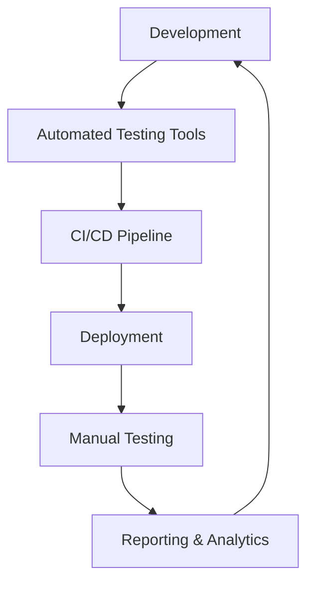

# Accessibility Testing: Enterprise Deep Dive

## Introduction

Accessibility testing is an essential aspect of web and software development, aimed at ensuring that applications are usable by people with a wide range of disabilities. The goal is to make digital content accessible to all users, including those with visual, auditory, motor, or cognitive impairments. This documentation provides a comprehensive analysis of accessibility testing, focusing on advanced architecture, edge cases, and methodologies for testing complex applications like single-page applications (SPAs) and dynamic content.

The World Wide Web Consortium (W3C) has established the Web Content Accessibility Guidelines (WCAG) as a standard for web accessibility. We will explore WCAG 2.1 and the upcoming 2.2 criteria to understand how they can be applied in accessibility testing.

## Advanced Architecture for Accessibility Testing

### Architectural Overview

The architecture for accessibility testing in an enterprise environment must be robust, scalable, and integrated with the development lifecycle. It typically involves a combination of manual testing, automated testing tools, and continuous integration/continuous deployment (CI/CD) pipelines.

#### Components of Accessibility Testing Architecture

1. **Automated Testing Tools**: Tools like Axe, WAVE, and Lighthouse are essential for programmatically checking against WCAG criteria. They can be integrated into CI/CD pipelines to automatically flag accessibility issues during the build process.

2. **Manual Testing**: Despite automation, manual testing is crucial for evaluating aspects that require human judgment, such as ensuring logical tab order or verifying correct semantic markup.

3. **CI/CD Integration**: Integrate accessibility testing into CI/CD pipelines to ensure continuous compliance. This setup enables developers to catch and rectify accessibility issues early in the development process.

4. **Accessibility Testing Framework**: A dedicated framework that supports both automated and manual testing methods, providing a cohesive approach to accessibility validation.

5. **Reporting and Analytics**: Systems to collect, analyze, and report on accessibility issues, offering insights into compliance status and areas needing improvement.

### Architectural Diagram

Below is a simplified architectural diagram using Mermaid syntax to illustrate how these components interact in an enterprise setting.



### Detailed Architectural Workflow

1. **Development Phase**:
   - Developers write code while adhering to accessibility best practices.
   - Use of linters and pre-commit hooks to enforce basic accessibility rules.

2. **Automated Testing**:
   - Automated tools scan the application for WCAG violations.
   - Tools generate reports that are fed back into the development process.

3. **CI/CD Pipeline**:
   - Integrates automated testing tools to run accessibility tests on each build.
   - Ensures that accessibility checks are part of the standard build verification process.

4. **Deployment**:
   - Applications that pass accessibility checks are deployed to staging or production environments.
   - Post-deployment, manual testers conduct exploratory testing to catch subtle issues.

5. **Manual Testing**:
   - Accessibility experts use assistive technologies (e.g., screen readers) to evaluate the user experience.
   - Manual testing covers aspects not easily captured by automated tools, such as subjective user experience and keyboard navigation.

6. **Reporting & Analytics**:
   - Aggregated data from both automated and manual testing is analyzed.
   - Use of dashboards to visualize compliance status and track improvements over time.

## Edge Cases in Accessibility Testing

### Complex Single-Page Applications (SPAs)

SPAs pose significant challenges for accessibility due to their dynamic nature. Key issues include ensuring that screen readers accurately convey changes in content, maintaining focus order, and providing meaningful ARIA (Accessible Rich Internet Applications) roles and attributes.

#### Strategies for SPAs

1. **Dynamic Content Updates**:
   - Implement ARIA live regions to announce changes to users without a full page reload.
   - Example: `aria-live="polite"` for non-urgent updates, `aria-live="assertive"` for critical updates.

2. **Focus Management**:
   - Ensure that focus is managed correctly during navigation or after content updates.
   - Example: Automatically move focus to new content when it appears.

3. **Semantic HTML and ARIA Attributes**:
   - Use semantic HTML elements and ARIA roles to define the structure and behavior of dynamic content.
   - Example: `<button role="button">` or `<div role="alert" aria-live="assertive">`.

4. **Testing Tools for SPAs**:
   - Use browser extensions and developer tools that simulate assistive technologies to test dynamic changes.
   - Example: Use Axe DevTools to check for accessibility violations related to dynamic elements.

### WCAG 2.1/2.2 Criteria and Complex Scenarios

WCAG 2.1 introduced several success criteria to address mobile accessibility, low vision, and cognitive disabilities. The upcoming WCAG 2.2 aims to further enhance these guidelines.

#### Key WCAG 2.1 Criteria

1. **1.4.10 Reflow**:
   - Ensure content can be presented without loss of information or functionality and without requiring scrolling in two dimensions for vertical content at a width equivalent to 320 CSS pixels.

2. **2.5.1 Pointer Gestures**:
   - All functionality that uses multipoint or path-based gestures is operable with a single pointer.

3. **4.1.3 Status Messages**:
   - Ensure status messages can be programmatically determined through role or properties so that they can be presented to the user by assistive technologies without receiving focus.

#### Upcoming WCAG 2.2 Criteria

1. **2.4.13 Fixed Reference Points**:
   - Ensure that all navigable content has fixed reference points for users to orient themselves within the content.

2. **3.2.6 Consistent Help**:
   - Provide consistent help mechanisms on each page where it is available.

### Handling Dynamic Content

Dynamic content, often seen in SPAs and modern web applications, requires special attention to ensure accessibility. Here are some advanced techniques:

1. **ARIA Live Regions**:
   - Example: `<div aria-live="polite">` can be used to dynamically announce updates without interrupting the user experience.

2. **Keyboard Navigation**:
   - Ensure all interactive elements are keyboard accessible and navigation order is logical.
   - Example: Use `tabindex` to control the order of navigation.

3. **Testing Dynamic Content**:
   - Regularly test dynamic components with screen readers to ensure updates are announced correctly and navigation remains intuitive.

4. **Semantic Structure**:
   - Use HTML5 elements and ARIA landmarks to define the structure of the page, aiding navigation for screen readers.
   - Example: `<header>`, `<nav>`, `<main>`, and `<footer>` elements.

By understanding and implementing these advanced architectural components and strategies, organizations can significantly improve the accessibility of their digital products, ensuring inclusivity and compliance with all users' needs.


## Performance Tuning for Accessibility Testing

Performance tuning in accessibility testing is a critical aspect that ensures the testing process is efficient and effective. This involves optimizing the tools and frameworks used in testing to minimize execution time and resource usage while maintaining thorough and accurate results. This section delves into various strategies and techniques for tuning performance in accessibility testing.

### 1. Optimizing Accessibility Testing Tools

#### 1.1 Tool Configuration

Many accessibility testing tools offer configuration options that can significantly impact performance. Adjust these settings to optimize the tool for your specific environment:

- **Limit the Scope of Testing:**
  - Configure the tool to test only the necessary parts of the application.
  - Use page-specific configurations to target high-priority areas.
  
- **Parallel Execution:**
  - Enable parallel execution if the tool supports it to reduce overall test time.
  - Use a test runner that supports parallelization, such as Jest or Mocha.

#### 1.2 Resource Allocation

- **CPU and Memory Tuning:**
  - Allocate sufficient CPU and memory resources to the testing environment.
  - Monitor resource usage and adjust based on performance bottlenecks observed during testing.

- **Network Optimization:**
  - Ensure a stable and high-speed network connection to reduce latency during testing, especially for web applications.

### 2. Enterprise Patterns for Accessibility Testing

Enterprise patterns are essential for scaling accessibility testing across large and complex systems. These patterns help maintain consistency, reusability, and efficiency.

#### 2.1 Test Automation Frameworks

- **Modular Architecture:**
  - Utilize a modular approach to design test scripts. This involves creating reusable components that can be used across different tests.
  - Example: Create a module for common accessibility checks and reuse it in various test cases.

- **Page Object Model (POM):**
  - Implement the Page Object Model to separate test logic from page structure. This reduces maintenance overhead and improves test readability.

#### 2.2 Integration with Development Processes

- **Shift-left Testing:**
  - Integrate accessibility testing early in the development process.
  - Use pre-commit hooks to run accessibility tests before code is merged into the main branch.

- **Continuous Feedback:**
  - Provide continuous feedback to developers by integrating test results into development tools like Jira or Slack.

### 3. CI/CD Pipeline Integration Details

Integrating accessibility testing into CI/CD pipelines ensures that accessibility is consistently verified with each build. This section outlines how to achieve seamless integration.

#### 3.1 Tool Selection and Setup

- **Tool Compatibility:**
  - Choose tools that are compatible with your CI/CD system (e.g., Jenkins, GitHub Actions, GitLab CI).

- **Environment Setup:**
  - Configure the CI/CD environment with necessary dependencies and tools.
  - Example YAML configuration for GitHub Actions:

    ```yaml
    name: Accessibility Test

    on: [push]

    jobs:
      test:
        runs-on: ubuntu-latest

        steps:
        - name: Checkout code
          uses: actions/checkout@v2

        - name: Set up Node.js
          uses: actions/setup-node@v2
          with:
            node-version: '14'

        - name: Install dependencies
          run: npm install

        - name: Run accessibility tests
          run: npm run test:accessibility
    ```

#### 3.2 Pipeline Optimization

- **Test Caching:**
  - Use caching mechanisms to cache dependencies and test results, reducing setup time for subsequent runs.

- **Conditional Execution:**
  - Configure conditional execution to run accessibility tests only when relevant changes are detected (e.g., changes in front-end code).

#### 3.3 Reporting and Notifications

- **Automated Reporting:**
  - Integrate automated reporting to generate detailed test reports.
  - Example: Generate a report in HTML format and upload it as an artifact.

- **Notification Systems:**
  - Configure notifications to alert stakeholders of test results via email or messaging platforms like Slack.

### 4. Custom Rule Creation for Accessibility Testing

Creating custom rules allows teams to tailor accessibility testing to specific needs and requirements. This section describes how to create and implement custom rules.

#### 4.1 Rule Definition

- **Understand the Need:**
  - Identify specific accessibility requirements unique to your application that are not covered by standard rules.

- **Define the Rule:**
  - Write a description of the rule, including the accessibility standard it addresses (e.g., WCAG 2.1).

#### 4.2 Implementation

- **Custom Rule in Axe:**
  - Use Axe’s API to define custom rules. Here’s a basic example:

    ```javascript
    const axe = require('axe-core');

    axe.configure({
      rules: [
        {
          id: 'custom-rule',
          selector: '.my-custom-element',
          enabled: true,
          metadata: {
            description: 'Custom rule for my specific element',
            help: 'Ensure .my-custom-element meets accessibility standards'
          },
          tags: ['custom'],
          any: [function (node) {
            return {
              result: node.matches('.my-custom-element') ? true : false,
              message: 'Custom element should be accessible'
            };
          }]
        }
      ]
    });
    ```

#### 4.3 Testing and Validation

- **Validate the Rule:**
  - Run tests to validate that the custom rule correctly identifies accessibility issues.
  - Ensure that the rule does not produce false positives or negatives.

### 5. Advanced Automation Frameworks

Advanced automation frameworks like Playwright, Cypress, and Selenium, combined with tools like Axe, offer robust solutions for accessibility testing.

#### 5.1 Playwright with Axe

Playwright, known for its cross-browser capabilities, can be integrated with Axe for comprehensive accessibility testing.

- **Setup:**

  ```bash
  npm install playwright axe-core axe-playwright
  ```

- **Example Script:**

  ```javascript
  const { chromium } = require('playwright');
  const { injectAxe, checkA11y } = require('axe-playwright');

  (async () => {
    const browser = await chromium.launch();
    const page = await browser.newPage();
    await page.goto('http://example.com');

    // Inject Axe for accessibility testing
    await injectAxe(page);

    // Run accessibility checks
    await checkA11y(page);

    await browser.close();
  })();
  ```

#### 5.2 Cypress with Axe

Cypress offers fast and reliable end-to-end testing capabilities, which can be enhanced with Axe for accessibility testing.

- **Setup:**

  ```bash
  npm install cypress @axe-core/cypress
  ```

- **Example Script:**

  ```javascript
  import 'cypress-axe';

  describe('Accessibility Test', () => {
    it('should have no accessibility violations', () => {
      cy.visit('http://example.com');
      cy.injectAxe();
      cy.checkA11y();
    });
  });
  ```

#### 5.3 Selenium with Axe

Selenium, a widely-used automation framework, can also be integrated with Axe for accessibility checks.

- **Setup:**

  ```bash
  pip install selenium
  npm install axe-selenium-python
  ```

- **Example Script:**

  ```python
  from selenium import webdriver
  from axe_selenium_python import Axe

  driver = webdriver.Chrome()
  driver.get("http://example.com")

  axe = Axe(driver)
  axe.inject()
  results = axe.run()
  axe.write_results(results, 'accessibility_report.json')

  driver.quit()
  ```

### Conclusion

Performance tuning, enterprise patterns, CI/CD integration, custom rule creation, and advanced automation frameworks form the cornerstone of efficient accessibility testing. By following these detailed strategies and configurations, teams can ensure that accessibility testing is not only effective but also seamlessly integrated into the software development lifecycle.


## Advanced Accessibility Testing Strategies

### Introduction

As digital products become more integral to daily life, ensuring they are accessible to all users, including those with disabilities, is not just a legal requirement but a moral imperative. Advanced accessibility testing strategies are essential for identifying and rectifying accessibility issues that might not be apparent through basic testing methods. This section explores sophisticated techniques in accessibility testing, leveraging modern tools and methodologies to enhance the accessibility of digital products.

### Automated Accessibility Testing Tools

Automated tools are essential for scaling accessibility testing efforts. They can quickly identify common accessibility issues across web applications. However, they should be part of a broader testing strategy that includes manual and exploratory testing.

#### Popular Tools and Frameworks

1. **Axe by Deque Systems**: Axe is a popular accessibility testing tool that can be integrated into various development environments. It provides a comprehensive API for testing both web and mobile applications.

   **Example Integration with Selenium:**

   ```java
   import org.openqa.selenium.WebDriver;
   import org.openqa.selenium.chrome.ChromeDriver;
   import com.deque.axe.AXE;
   import org.json.JSONArray;
   import org.json.JSONObject;

   public class AccessibilityTest {
       private static final String AXE_SCRIPT_URL = "https://cdnjs.cloudflare.com/ajax/libs/axe-core/4.3.5/axe.min.js";
       
       public static void main(String[] args) {
           WebDriver driver = new ChromeDriver();
           driver.get("https://example.com");
           
           JSONObject responseJSON = new AXE.Builder(driver, AXE_SCRIPT_URL).analyze();
           JSONArray violations = responseJSON.getJSONArray("violations");
           
           if (violations.length() == 0) {
               System.out.println("No accessibility violations found");
           } else {
               AXE.writeResults("AccessibilityTest", responseJSON);
               System.out.println(AXE.report(violations));
           }
           
           driver.quit();
       }
   }
   ```

2. **Pa11y**: Pa11y is an accessibility testing tool that can be run from the command line, making it easy to integrate into CI/CD pipelines.

   **Command Line Usage:**

   ```bash
   pa11y https://example.com
   ```

   **Output Configuration:**

   Pa11y allows customization of its output using different reporters such as JSON, HTML, and Markdown. This flexibility facilitates the integration of accessibility testing results into various reporting tools.

   ```bash
   pa11y --reporter html https://example.com > report.html
   ```

3. **Lighthouse**: Integrated into Chrome DevTools, Lighthouse provides accessibility audits alongside performance and SEO checks. It generates a report with actionable insights to improve accessibility.

   **Running Lighthouse from the Command Line:**

   ```bash
   lighthouse https://example.com --output=json --output-path=./report.json --only-categories=accessibility
   ```

### Advanced Manual Testing Techniques

While automated tools are powerful, they cannot catch all accessibility issues. Advanced manual testing techniques are necessary to understand the user experience fully.

#### Screen Reader Testing

Screen readers are vital for users with visual impairments, and testing with them is crucial for ensuring that content is accessible.

- **NVDA (NonVisual Desktop Access)**: Free and open-source screen reader for Windows.
- **JAWS (Job Access With Speech)**: A widely used screen reader with extensive support for web applications.

**Testing Procedure:**

1. **Navigate the site using only the keyboard**: Ensure that all interactive elements are accessible via keyboard navigation.
2. **Headings Structure**: Verify that headings are used semantically and in a logical order.
3. **Alt Text**: Ensure that all images have descriptive alternative text.

**Example Checklist:**

- [ ] Can the site be navigated using tab and shift-tab?
- [ ] Are ARIA roles and landmarks correctly implemented?
- [ ] Does each form control have an associated label?

### Machine Learning in Accessibility

Machine learning (ML) offers innovative solutions for accessibility testing by identifying patterns and anomalies in large datasets that might not be immediately apparent through traditional methods.

#### Image Recognition for Alt Text

ML models can be trained to generate alt text for images automatically, enhancing accessibility for users relying on screen readers.

**Example with TensorFlow and Keras:**

```python
from tensorflow.keras.applications import VGG16
from tensorflow.keras.preprocessing import image
from tensorflow.keras.applications.vgg16 import preprocess_input, decode_predictions
import numpy as np

model = VGG16(weights='imagenet')

def generate_alt_text(img_path):
    img = image.load_img(img_path, target_size=(224, 224))
    x = image.img_to_array(img)
    x = np.expand_dims(x, axis=0)
    x = preprocess_input(x)

    preds = model.predict(x)
    return decode_predictions(preds, top=3)[0]

print(generate_alt_text('path/to/image.jpg'))
```

#### Natural Language Processing for Text Analysis

NLP can help evaluate the complexity and clarity of language used in web content, ensuring it is accessible to individuals with cognitive disabilities.

**Example with SpaCy:**

```python
import spacy
from readability import Readability

nlp = spacy.load("en_core_web_sm")
text = "The quick brown fox jumps over the lazy dog."

doc = nlp(text)
readability_score = Readability(text).flesch_kincaid()

print(f"Readability Score: {readability_score}")
```

### Future Trends in Accessibility Testing

Accessibility testing is poised for significant advancement with the integration of emerging technologies and methodologies.

#### AI and Automation

Artificial Intelligence (AI) is set to revolutionize accessibility testing by automating complex decision-making processes and providing predictive insights on accessibility issues.

- **Predictive Accessibility Modeling**: Using AI to predict potential accessibility issues based on historical data and patterns.
- **Automated Code Refactoring**: AI-driven tools that automatically refactor code to comply with accessibility standards.

#### Virtual and Augmented Reality

With the growing popularity of VR and AR applications, accessibility testing will need to adapt to these new media.

- **Haptic Feedback Devices**: Ensuring that VR experiences are accessible through alternative feedback mechanisms like haptic devices.
- **Spatial Audio Testing**: Ensuring that audio cues in VR are accessible to users with varying degrees of hearing ability.

#### Enhanced Regulatory Frameworks

As laws and standards evolve, accessibility testing will need to adapt to ensure compliance with the latest regulations.

- **WCAG 3.0**: The next iteration of the Web Content Accessibility Guidelines will likely introduce new success criteria and guidelines for emerging technologies.

### Conclusion

Advanced accessibility testing strategies are crucial for ensuring that digital products are inclusive and usable for all users. By combining automated tools, manual testing, and emerging technologies like machine learning, organizations can significantly enhance their accessibility testing efforts. As technology continues to evolve, so too must our strategies and tools for ensuring accessibility.