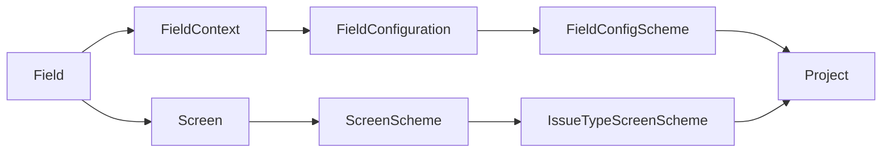

# 31 - Jira Field Schemas Advanced

## Introduction

Jira Service Management (JSM), as a sophisticated ITSM and work management platform, relies heavily on its data model, wherein **fields** form the foundational elements of issue representation and workflow processing. While basic field administration—creating fields, associating them with screens, and configuring visibility—is well understood by many administrators, the advanced management of **Field Schemas**, **Field Contexts**, and their intricate relationships with **Screens**, **Screen Schemes**, and **Issue Type Screen Schemes** is a nuanced discipline that distinguishes expert architects. This document provides a comprehensive, technically deep examination of Jira's field architecture, focusing on advanced field contexts, field schema design for scalability, and the evolution towards the unified **Field Schemes** experience slated for 2026.

## 1. Architectural Overview: Fields in Jira

Fields in Jira are metadata containers attached to issues (work items). Each field holds a specific piece of information—text, number, date, user, option set, or asset reference—that defines the issue's attributes. Fields are categorized as **System Fields** (built-in, immutable types like Summary, Assignee, Status) or **Custom Fields** (created by administrators to fit organizational needs).

### 1.1. Core Components of Field Architecture

To appreciate the advanced schema design, it’s vital to clarify the components involved and their relationships:

| Component                   | Description                                                                                                     |
|-----------------------------|-----------------------------------------------------------------------------------------------------------------|
| **Field**                   | The atomic data element; defined by type (text, user picker, select list, etc.), name, and description.         |
| **Field Context**           | Defines scope and restrictions of a field: which projects (spaces) and issue types (work types) it applies to, along with default values and option sets. |
| **Field Configuration**     | Defines field behavior (required, optional, hidden), descriptions, and renderers (wiki vs plain text) within a context. |
| **Field Configuration Scheme** | Maps multiple field configurations to specific issue types, enabling different field behaviors per issue type in a project. |
| **Screen**                  | UI construct determining which fields are displayed when creating, editing, or viewing issues.                  |
| **Screen Scheme**           | Maps screens to operations (Create, Edit, View).                                                                |
| **Issue Type Screen Scheme** | Maps screen schemes to issue types within a project.                                                            |
| **Project (Space)**         | Container for issues; associates a set of schemes (field configuration, screen, workflow) to control issue behavior. |

### 1.2. Interaction Diagram



This diagram illustrates the dual paths by which fields are controlled: one through configuration (visibility, requirement, rendering), and the other through UI presentation (screens and schemes). Both paths are linked to the project context and issue types, making the relationships complex but flexible.

---

## 2. Advanced Field Contexts: Controlling Scope, Defaults, and Restrictions

Field Contexts represent one of the most powerful yet underutilized mechanisms for fine-grained control over field behavior in Jira. They enable administrators to tailor fields dynamically across different projects or issue types.

### 2.1. Purpose and Mechanics of Field Contexts

Every custom field can have multiple **contexts**. Each context defines the subset of projects and issue types where the field applies. This facilitates scenarios where the same field behaves differently across projects or where it is present only in certain issue types.

For example, a "Hardware Model" field used only in IT Asset Management projects can have a context restricting it to those projects and relevant issue types, keeping other projects clean from irrelevant fields.

### 2.2. Default Values per Context

Field contexts allow setting **default values** scoped to that context. This means that when creating a new issue in a project or issue type covered by that context, the field's value is pre-populated with the specified default, improving data consistency and reducing user input.

For text fields, default values are straightforward strings. For select lists or user pickers, defaults must be valid options or users within the context's options.

### 2.3. Custom Option Sets per Context

Fields with predefined options (e.g., select lists, radio buttons, checkboxes) can have **option sets customized per context**. This allows the same field to present different options depending on the project or issue type, a critical feature for global fields that must adapt to different organizational units.

For example, a "Priority" custom field might have a context in IT projects with options ["Critical", "High", "Medium", "Low"] but a different option set in HR projects, e.g., ["Urgent", "Normal", "Low Priority"].

### 2.4. User Picker Restrictions in Contexts

User picker fields (single or multi-select) can be restricted by context to only show users from certain **groups** or **space roles**. This prevents irrelevant or unauthorized users from being selected in certain projects or issue types.

Notably, inactive users are automatically hidden from these pickers. If no groups or roles are selected in the restriction, the field will display no users, effectively disabling selection.

### 2.5. REST API Example: Field Contexts Configuration

The Jira Cloud REST API exposes field schema details, including contexts. Below is an illustrative snippet showing a custom select list field with multiple contexts specifying different option sets and default values.

```json
{
  "customId": 10100,
  "name": "Customer Priority",
  "type": "option",
  "contexts": [
    {
      "id": 1,
      "projects": ["IT Support", "Network Ops"],
      "issueTypes": ["Incident", "Request"],
      "options": [
        {"value": "Critical", "id": "1001"},
        {"value": "High", "id": "1002"},
        {"value": "Medium", "id": "1003"},
        {"value": "Low", "id": "1004"}
      ],
      "defaultOption": {"value": "Medium", "id": "1003"}
    },
    {
      "id": 2,
      "projects": ["HR", "Finance"],
      "issueTypes": ["Task"],
      "options": [
        {"value": "Urgent", "id": "2001"},
        {"value": "Normal", "id": "2002"},
        {"value": "Low Priority", "id": "2003"}
      ],
      "defaultOption": {"value": "Normal", "id": "2002"}
    }
  ]
}
```

This JSON structure illustrates how contexts govern the available options and defaults based on project and issue type scope.

---

## 3. Complex Interplay: Fields, Screens, Screen Schemes, and Issue Type Screen Schemes

Understanding the UI path of fields—how they are surfaced to users—is critical for building maintainable and scalable schemes.

### 3.1. Screens and Field Presentation

A **Screen** is a collection of fields presented together during a specific operation: creating, editing, viewing, or transitioning an issue. Each screen defines which fields appear and the order of their display.

Screens are reusable UI components; a screen named "Incident Create Screen" might be used in multiple projects or issue types.

### 3.2. Screen Schemes: Mapping Screens to Operations

A **Screen Scheme** maps three operations—Create, Edit, View—to screens. For example, a screen scheme might specify that the "Incident Create Screen" is used during issue creation, "Incident Edit Screen" during editing, and "Incident View Screen" when viewing.

This abstraction allows reusing screens across different operations and projects.

### 3.3. Issue Type Screen Schemes: Mapping Screen Schemes to Work Types

The **Issue Type Screen Scheme** maps screen schemes to issue types (work types). This means that different issue types in the same project can have completely different UI setups for create/edit/view operations.

For instance, "Incident" issues may use one screen scheme with specialized fields, while "Change Request" issues use another.

### 3.4. Fields and Screens: Visibility Control

Fields only appear to users if they are included in screens. This is an important point: even if a field is configured to be visible and required in its field configuration, if it is not added to the screen(s) used by the project and issue type, it will not be seen or editable.

Thus, managing field schemas without careful screen management is futile.

### 3.5. Example Table: Mapping Fields to Screens and Operations

| Issue Type   | Operation | Screen Used               | Included Fields                                            |
|--------------|------------|---------------------------|------------------------------------------------------------|
| Incident     | Create     | Incident Create Screen     | Summary, Description, Impact, Customer Priority, Assignee |
| Incident     | Edit       | Incident Edit Screen       | Summary, Description, Impact, Customer Priority, Assignee |
| Incident     | View       | Incident View Screen       | Summary, Description, Status, Resolution, Comments        |
| Change Request | Create   | CR Create Screen           | Summary, Description, Risk Level, Change Window           |
| Change Request | Edit     | CR Edit Screen             | Summary, Description, Risk Level, Change Window           |
| Change Request | View     | CR View Screen             | Summary, Description, Status, Comments                    |

This tabular representation reveals how fields are surfaced differently per issue type and operation.

---

## 4. Designing Enterprise-Grade Field Schemas at Scale

Organizations with hundreds of projects and complex issue hierarchies face unique challenges in field schema design. Scaling thoughtfully ensures performance, maintainability, and adherence to Jira Cloud’s field limits.

### 4.1. Field Limits and Upcoming 2026 Changes

Jira Cloud imposes limits on field configurations and schemes to ensure performance and reliability:

- A **Field Configuration** can include up to **700 fields**.
- A **Field Configuration Scheme** can map up to **150 issue types**.
- Projects can associate only one field configuration scheme at a time.

In **February 2026**, Atlassian will retire traditional field configurations and configuration schemes, replacing them with a unified **Field Schemes** experience, which alters how fields are managed (details in section 5).

### 4.2. Field Schema Design Principles

To design scalable, enterprise-grade field schemas, architects should:

- **Avoid redundant fields**: Reuse fields wherever possible rather than creating new similar fields.
- **Leverage Field Contexts**: Use contexts to vary field options and defaults instead of creating separate fields per project.
- **Limit field visibility via screens**: Do not add fields to screens unnecessarily.
- **Group issue types logically**: Map similar issue types to the same field configuration to reduce the number of schemes.
- **Consolidate screens and screen schemes**: Reuse screens and schemes across projects and issue types to ease administration.
- **Document field usage**: Maintain a field dictionary to track field purposes, contexts, and associated projects.

### 4.3. Field Contexts vs Field Configurations

Field contexts help reduce the need for multiple fields by enabling one field to behave differently in different scopes, which reduces the total number of fields in the system. This is critical because each field consumes system resources and complicates reporting.

Field configurations control the *behavior* of fields (required/optional, renderer), while contexts control *where* and *how* field data is collected (options, default).

### 4.4. Managing Field Visibility and Behavior

Using field configurations, administrators set fields as required or optional and choose rendering options. Required fields must be visible on the **Create** screen; thus, screen design directly impacts field behavior.

Fields made hidden in configurations are not shown on any screen, effectively disabled without deletion.

### 4.5. Handling Unique Requirements with Contexts

For example, a "Customer Satisfaction" field may be required and visible only in support projects but optional or hidden elsewhere. This can be achieved by defining two contexts for the field—one scoped to support projects with default values and option sets and another default context with the field hidden or optional.

This approach avoids field duplication and keeps the Jira instance streamlined.

---

## 5. The New Unified Field Schemes Experience (2026 Update)

Atlassian is evolving Jira’s field management model with a **unified Field Schemes** experience, retiring Field Configurations and Field Configuration Schemes.

### 5.1. Motivations for Change

The existing model, while powerful, is complex and has led to administrative overhead, particularly in large instances with many projects and issue types.

The unified model aims to simplify field management by:

- Eliminating the fragmented mapping between configurations and schemes.
- Removing field contexts as controllers of field visibility.
- Providing a consolidated interface for administrators to manage fields, visibility, and behavior.

### 5.2. Key Differences in the Unified Model

In the new experience:

- **Field contexts will no longer restrict field visibility or options.** Instead, visibility rules are enforced via the new Field Schemes interface.
- Field schemes will combine configuration and context settings into a single construct, reducing fragmentation.
- The new model will better support dynamic changes and scaling.
- Deprecated entities (Field Configurations, Field Configuration Schemes) will be phased out, with migration tooling provided.

### 5.3. Impact on Enterprise Design

Architects must prepare for the transition by:

- Auditing existing field configurations and contexts.
- Mapping current schemes to the new model.
- Reviewing field usage and rationalizing redundant or underused fields.
- Designing field schemes with clear visibility and behavior rules aligned with organizational processes.

### 5.4. Current Admin Experience vs Future Unified Interface

| Feature                              | Current Model                          | Future Unified Model                |
|------------------------------------|--------------------------------------|-----------------------------------|
| Field Visibility Control           | Field Contexts + Field Configurations | Centralized in Field Schemes       |
| Option Sets per Context             | Supported via Contexts                 | Managed via Field Schemes           |
| User Picker Restrictions           | Context-based                        | Managed via Field Schemes           |
| Number of Schemes per Project       | Multiple schemes (field config & screen) | Single unified field scheme per project |
| Complexity                        | High, multiple mappings               | Reduced, single interface           |

---

## 6. REST API Schema Details for Field Management

Administrators and architects can leverage Jira’s REST API to audit, create, and manage fields, contexts, and schemes programmatically.

### 6.1. Field Schema JSON Structure

Each field returned by the API includes these attributes:

| Attribute    | Description                                                                                                     |
|--------------|-----------------------------------------------------------------------------------------------------------------|
| `id`         | Unique identifier of the field                                                                                   |
| `name`       | Display name of the field                                                                                        |
| `type`       | Data type (string, number, date, datetime, option, user, group, version, etc.)                                   |
| `system`     | System field identifier if applicable (e.g., summary, assignee)                                                 |
| `custom`     | Custom field type identifier (e.g., com.atlassian.jira.plugin.system.customfieldtypes:textfield)                  |
| `customId`   | Numeric ID of the custom field                                                                                   |
| `items`      | For array types, the data type of array elements                                                                |
| `contexts`   | List of field contexts and their options (for fields with predefined options)                                    |

### 6.2. Example API Call: Fetch Field by ID

```bash
GET /rest/api/3/field/{fieldId}
Authorization: Bearer <token>
Accept: application/json
```

Example response snippet:

```json
{
  "id": "customfield_10100",
  "name": "Customer Priority",
  "type": "option",
  "custom": "com.atlassian.jira.plugin.system.customfieldtypes:select",
  "customId": 10100,
  "contexts": [
    {
      "id": 1,
      "projects": ["IT Support"],
      "issueTypes": ["Incident"],
      "options": [
        {"value": "Critical", "id": "1001"},
        {"value": "High", "id": "1002"}
      ],
      "defaultOption": {"value": "High", "id": "1002"}
    }
  ]
}
```

### 6.3. Managing Field Contexts via API

The API supports creating, updating, and deleting field contexts, including setting option lists and default values. This allows automation of large-scale schema adjustments.

---

## 7. Case Study: Enterprise Field Schema Design

An enterprise with 250 projects and 100 distinct issue types needed to streamline their field architecture. Initially, they had 1200 custom fields and multiple field configuration schemes, leading to performance issues and administrative complexity.

### 7.1. Challenges

- **Performance degradation** due to excessive fields and complex schemes.
- **User confusion** from inconsistent fields across projects.
- **Difficulty in maintenance**: high redundancy and overlapping contexts.
- **Approaching 2026 field limits**: exceeding 700 fields per configuration and 150 issue types per scheme.

### 7.2. Solution Approach

The team undertook a rationalization exercise:

- Consolidated similar fields: merged multiple "Customer Priority" variants into one with multiple contexts.
- Leveraged **field contexts** to vary option lists and default values instead of creating new fields.
- Standardized screens and screen schemes for common issue types.
- Reduced the number of field configurations by grouping similar issue types.
- Prepared for the unified Field Schemes by documenting all current mappings and visibility rules.

### 7.3. Outcome

Post-implementation, the Jira instance displayed:

- Reduced field count to under 700 in main configurations.
- Simplified field management with fewer schemes.
- Improved user experience with consistent field behavior.
- Streamlined transition path to the 2026 unified Field Schemes.

---

## 8. Summary and Best Practices

The advanced management of Jira Service Management Field Schemas demands a deep understanding of the multilayered architecture involving fields, contexts, configurations, and screens. Leveraging **field contexts** to control defaults, option sets, and user picker restrictions enables flexible, scalable field reuse across diverse projects and issue types. Careful design of **screens and screen schemes** ensures fields are visible and editable only where appropriate.

With the impending 2026 migration to **unified Field Schemes**, administrators must audit and rationalize existing field schemas to remain within limits and reduce complexity. Employing API-driven automation for schema management will be key to scaling effectively.

By mastering these concepts and tools, Jira architects can design enterprise-grade field schemas that scale gracefully, provide consistent data capture, and enhance the overall service management experience.

---

## Appendix: Field Type Summary for JSM

| Field Type            | Description                                                                             | Predefined Options | Context Restrictions | Default Value Support |
|-----------------------|-----------------------------------------------------------------------------------------|--------------------|----------------------|-----------------------|
| Assets                | Links to Assets/CMDB objects                                                            | No                 | Yes                  | Yes                   |
| Checkboxes            | Multiple selection from predefined options                                              | Yes                | Yes                  | Yes                   |
| Group Picker          | Select groups from Atlassian Directory (single or multi-select)                         | No                 | Yes                  | Yes                   |
| Label                 | Freeform tags or selection from existing labels                                         | No                 | Yes                  | Yes                   |
| Parent (Replaced Epic Link) | Links to parent issues or epics                                                     | No                 | Yes                  | No                    |
| Radio Buttons         | Single selection from predefined options                                               | Yes                | Yes                  | Yes                   |
| Select List           | Single, multiple, or cascading lists from predefined options                            | Yes                | Yes                  | Yes                   |
| Team                  | Select Atlassian Teams                                                                  | No                 | Yes                  | Yes                   |
| User Picker           | Single or multi-select user selection with group or role restrictions                   | No                 | Yes                  | Yes                   |
| Version Picker        | Select versions (single or multiple)                                                    | No                 | Yes                  | Yes                   |
| Date Picker           | Select calendar date                                                                    | No                 | Yes                  | Yes                   |
| Date Time Picker      | Select calendar date and time                                                           | No                 | Yes                  | Yes                   |
| Number Field          | Numeric input with formatting options (number, currency, percentage)                    | No                 | Yes                  | Yes                   |
| Paragraph Text        | Multi-line rich text                                                                    | No                 | Yes                  | Yes                   |
| Short Text            | Single line plain text (max 255 chars)                                                 | No                 | Yes                  | Yes                   |

---

This document synthesizes Atlassian’s official documentation and community knowledge into a definitive guide for advanced Jira Service Management field schema architecture, empowering administrators to build scalable, maintainable, and future-proof configurations aligned with organizational needs and platform evolution.