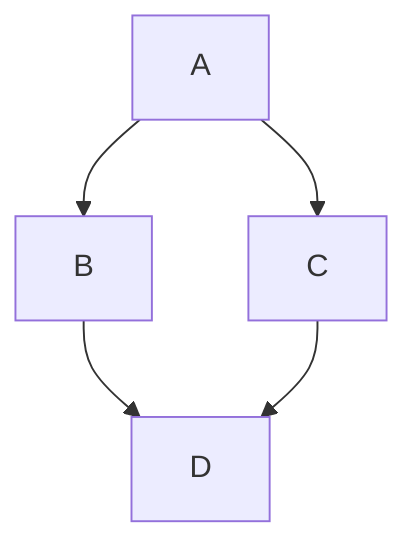

# Wiki.js CLI and API Reference Guide

## Introduction

Wiki.js is a powerful, modern, and open-source wiki platform built on Node.js, Vue.js, and GraphQL. As an enterprise-grade knowledge management system, it provides extensive capabilities for automation, integration, and administration through its GraphQL API and various command-line interfaces. This comprehensive reference guide is designed for system administrators, DevOps engineers, and developers who need to interact with Wiki.js programmatically or manage its infrastructure from the command line.

Wiki.js v2.x, the current stable version, exposes almost all of its functionality through a robust GraphQL API endpoint located at `/graphql`. This API is the same one used by the Wiki.js frontend, ensuring that any action possible through the web interface can also be automated via API calls. Furthermore, managing a Wiki.js deployment involves interacting with Docker, Kubernetes, and database command-line tools, especially in high-availability (HA) setups or disaster recovery scenarios.

This document covers the complete spectrum of Wiki.js operations, including GraphQL API authentication, page mutations, page queries, user and group management, asset uploads, Docker and Kubernetes deployment commands, and database-level interventions.

---

## GraphQL API Authentication

All API requests to Wiki.js must be authenticated using a Bearer token. These tokens are generated within the Wiki.js administration panel under the **API Access** section. 

### Generating an API Token

To generate an API token, an administrator must navigate to the Administration area, select API Access, and create a new key. The key can be assigned specific permissions, which map directly to the GraphQL mutations and queries it can execute. Available permissions include `read:pages`, `write:pages`, `manage:pages`, `delete:pages`, `write:styles`, `write:scripts`, `read:source`, `read:history`, and `manage:system`.

### Using the Bearer Token

Once the token is generated, it must be included in the `Authorization` header of every HTTP request made to the `/graphql` endpoint.

**Example cURL Request:**

```bash
curl -X POST \
  -H "Content-Type: application/json" \
  -H "Authorization: Bearer YOUR_API_TOKEN_HERE" \
  -d '{"query": "{ site { title } }"}' \
  https://wiki.example.com/graphql
```

It is crucial to keep this token secure. If a token is compromised, it should be immediately revoked from the administration panel. There is no native API rate limiting in Wiki.js; therefore, it is highly recommended to implement rate limiting at the reverse proxy level (e.g., NGINX, Traefik, or Cloudflare) to prevent abuse of the API endpoint.

---

## Page Mutations

Page mutations allow you to create, update, move, delete, and manage the lifecycle of wiki pages programmatically. Wiki.js supports multiple editors, including `markdown`, `wysiwyg`, `ckeditor`, `code`, `api`, and `asciidoc`. When creating or updating a page, you must specify the content type corresponding to the editor used.

### Create Page

Creating a new page requires specifying the path, title, content, description, editor type, and locale. Note that page paths cannot contain dots, spaces, backslashes, or double slashes, and must not start or end with a slash.

**GraphQL Mutation:**

```graphql
mutation {
  pages {
    create(
      content: "# Hello World\n\nThis is a new page created via API.",
      description: "An example page",
      editor: "markdown",
      isPublished: true,
      isPrivate: false,
      locale: "en",
      path: "development/api-example",
      tags: ["api", "example"],
      title: "API Example Page"
    ) {
      responseResult {
        succeeded
        errorCode
        slug
        message
      }
      page {
        id
        path
        title
      }
    }
  }
}
```

**cURL Example:**

```bash
curl -X POST \
  -H "Content-Type: application/json" \
  -H "Authorization: Bearer YOUR_API_TOKEN" \
  -d '{"query": "mutation { pages { create(content: \"# Hello World\", description: \"Test\", editor: \"markdown\", isPublished: true, isPrivate: false, locale: \"en\", path: \"test-page\", tags: [], title: \"Test Page\") { responseResult { succeeded message } } } }"}' \
  https://wiki.example.com/graphql
```

### Update Page

Updating a page creates an automatic snapshot in the version history. You must provide the page ID and the updated fields.

**GraphQL Mutation:**

```graphql
mutation {
  pages {
    update(
      id: 123,
      content: "# Updated Content\n\nThis page has been updated.",
      description: "Updated description",
      editor: "markdown",
      isPublished: true,
      isPrivate: false,
      locale: "en",
      path: "development/api-example",
      tags: ["api", "updated"],
      title: "Updated API Example"
    ) {
      responseResult {
        succeeded
        message
      }
    }
  }
}
```

### Move Page

Moving a page changes its path and/or locale. This operation updates the page hash, which is calculated as `SHA1(locale + path + privateNS)`.

**GraphQL Mutation:**

```graphql
mutation {
  pages {
    move(
      id: 123,
      destinationPath: "development/new-api-example",
      destinationLocale: "en"
    ) {
      responseResult {
        succeeded
        message
      }
    }
  }
}
```

### Delete Page

Deleting a page removes it from the active wiki. Depending on the configuration, it may be soft-deleted or permanently removed.

**GraphQL Mutation:**

```graphql
mutation {
  pages {
    delete(id: 123) {
      responseResult {
        succeeded
        message
      }
    }
  }
}
```

### Convert Page Editor

Converting a page between different editors (e.g., from `markdown` to `wysiwyg`) is possible, but be aware of the known limitation: converting between editors may lose formatting.

**GraphQL Mutation:**

```graphql
mutation {
  pages {
    convert(id: 123, editor: "wysiwyg") {
      responseResult {
        succeeded
        message
      }
    }
  }
}
```

### Restore Page Version

You can restore a page to a previous version from its history.

**GraphQL Mutation:**

```graphql
mutation {
  pages {
    restore(id: 123, versionId: 456) {
      responseResult {
        succeeded
        message
      }
    }
  }
}
```

### Render Page

Forces the rendering engine to re-process the page content. This is useful if extensions or rendering rules have changed.

**GraphQL Mutation:**

```graphql
mutation {
  pages {
    render(id: 123) {
      responseResult {
        succeeded
        message
      }
    }
  }
}
```

### Flush Cache

Flushes the cache for a specific page, ensuring the latest content is served.

**GraphQL Mutation:**

```graphql
mutation {
  pages {
    flushCache(id: 123) {
      responseResult {
        succeeded
        message
      }
    }
  }
}
```

### Rebuild Tree

Rebuilds the navigation tree. This is an administrative function typically used when the tree becomes out of sync.

**GraphQL Mutation:**

```graphql
mutation {
  pages {
    rebuildTree {
      responseResult {
        succeeded
        message
      }
    }
  }
}
```

### Purge History

Purges the version history for a page, which can be useful for saving database space.

**GraphQL Mutation:**

```graphql
mutation {
  pages {
    purgeHistory(id: 123) {
      responseResult {
        succeeded
        message
      }
    }
  }
}
```

### Migrate to Locale

Migrates all pages from one locale to another.

**GraphQL Mutation:**

```graphql
mutation {
  pages {
    migrateToLocale(sourceLocale: "en", targetLocale: "en-US") {
      responseResult {
        succeeded
        message
      }
    }
  }
}
```

---

## Page Queries

Page queries allow you to retrieve information about pages, their history, and their relationships.

### List Pages

Retrieves a list of pages, optionally filtered and paginated.

**GraphQL Query:**

```graphql
query {
  pages {
    list(orderBy: TITLE, orderByDirection: ASC) {
      id
      path
      title
      locale
      updatedAt
    }
  }
}
```

### Single Page by ID

Retrieves detailed information about a single page using its ID.

**GraphQL Query:**

```graphql
query {
  pages {
    single(id: 123) {
      id
      path
      title
      content
      description
      editor
      createdAt
      updatedAt
    }
  }
}
```

### Single Page by Path

Retrieves a page using its path and locale.

**GraphQL Query:**

```graphql
query {
  pages {
    singleByPath(path: "development/api-example", locale: "en") {
      id
      title
      content
    }
  }
}
```

### Search Pages

Searches for pages using the configured search engine (e.g., PostgreSQL pg_trgm, Elasticsearch, Algolia).

**GraphQL Query:**

```graphql
query {
  pages {
    search(query: "API documentation") {
      results {
        id
        title
        description
        path
      }
    }
  }
}
```

### Page History

Retrieves the version history of a specific page.

**GraphQL Query:**

```graphql
query {
  pages {
    history(id: 123) {
      versionId
      createdAt
      authorName
      action
    }
  }
}
```

### Page Version

Retrieves the content of a specific historical version of a page.

**GraphQL Query:**

```graphql
query {
  pages {
    version(id: 123, versionId: 456) {
      content
      title
    }
  }
}
```

### Page Tree

Retrieves the hierarchical tree structure of pages.

**GraphQL Query:**

```graphql
query {
  pages {
    tree {
      id
      path
      title
      parent
      isFolder
    }
  }
}
```

### Page Links

Retrieves incoming and outgoing links for a page.

**GraphQL Query:**

```graphql
query {
  pages {
    links(id: 123) {
      incoming {
        id
        path
      }
      outgoing {
        id
        path
      }
    }
  }
}
```

### Page Tags

Retrieves all tags associated with pages.

**GraphQL Query:**

```graphql
query {
  pages {
    tags {
      tag
      count
    }
  }
}
```

### Check Conflicts

Checks for editing conflicts before saving a page. This is crucial since Wiki.js does not support real-time collaborative editing.

**GraphQL Query:**

```graphql
query {
  pages {
    checkConflicts(id: 123, updatedAt: "2023-10-27T10:00:00Z") {
      hasConflict
      latestVersionUpdatedAt
    }
  }
}
```

---

## User and Group Management

Managing users and groups via the API allows for automated onboarding and offboarding processes.

### Create User

**GraphQL Mutation:**

```graphql
mutation {
  users {
    create(
      email: "newuser@example.com",
      name: "New User",
      password: "SecurePassword123!",
      providerKey: "local",
      groups: [2]
    ) {
      responseResult {
        succeeded
        message
      }
      user {
        id
        email
      }
    }
  }
}
```

### Update User

**GraphQL Mutation:**

```graphql
mutation {
  users {
    update(
      id: 45,
      name: "Updated Name",
      groups: [2, 3]
    ) {
      responseResult {
        succeeded
        message
      }
    }
  }
}
```

### Delete User

**GraphQL Mutation:**

```graphql
mutation {
  users {
    delete(id: 45) {
      responseResult {
        succeeded
        message
      }
    }
  }
}
```

### Create Group

**GraphQL Mutation:**

```graphql
mutation {
  groups {
    create(
      name: "API Developers",
      permissions: ["read:pages", "write:pages"]
    ) {
      responseResult {
        succeeded
        message
      }
      group {
        id
        name
      }
    }
  }
}
```

---

## Asset Upload API

Uploading assets (images, documents) requires a multipart form-data request. The GraphQL API handles the metadata, while the actual file upload is processed through a specific endpoint.

**cURL Example for Asset Upload:**

```bash
curl -X POST \
  -H "Authorization: Bearer YOUR_API_TOKEN" \
  -F "mediaUpload=@/path/to/local/image.png" \
  -F "folderId=0" \
  https://wiki.example.com/graphql
```

Note: The exact implementation of asset uploads can vary based on the configured storage backend (e.g., S3, Azure, Local Disk). When using Cloudflare, ensure that Auto Minify, Mirage, and Rocket Loader are disabled, as they can break asset loading and uploads.

---

## Docker CLI Commands

Wiki.js is commonly deployed using Docker. The official image is `ghcr.io/requarks/wiki`. A companion container, `wiki-update-companion`, is used for handling updates.

### Starting the Stack

Using `docker-compose`, you can start the Wiki.js application and its database (preferably PostgreSQL for HA support).

```bash
docker-compose up -d
```

### Stopping the Stack

```bash
docker-compose down
```

### Viewing Logs

To troubleshoot issues, viewing the logs is essential.

```bash
docker-compose logs -f wiki
```

### Executing Commands Inside the Container

Sometimes you need to run commands directly inside the Wiki.js container.

```bash
docker-compose exec wiki /bin/sh
```

### Managing the Update Companion

The `wiki-update-companion` container must be updated separately from the main Wiki.js container. It handles the downloading and extraction of new Wiki.js versions.

```bash
docker pull ghcr.io/requarks/wiki-update-companion:latest
docker-compose restart wiki-update-companion
```

---

## Kubernetes Helm Chart Commands

For enterprise deployments, Kubernetes is often the platform of choice. Wiki.js provides an official Helm chart.

### Add the Helm Repository

```bash
helm repo add requarks https://charts.js.wiki
helm repo update
```

### Install Wiki.js

```bash
helm install my-wiki requarks/wiki -n wiki-namespace --create-namespace
```

### Upgrade Wiki.js

```bash
helm upgrade my-wiki requarks/wiki -n wiki-namespace -f custom-values.yaml
```

### Uninstall Wiki.js

```bash
helm uninstall my-wiki -n wiki-namespace
```

---

## Database CLI Operations

Direct database manipulation is sometimes necessary for disaster recovery, such as resetting an administrator password or fixing configuration issues when the web interface is inaccessible. PostgreSQL is the recommended database and is required for High Availability (HA) mode.

### Connecting to PostgreSQL

```bash
psql -h localhost -U wiki_user -d wiki_db
```

### Resetting an Administrator Password

If you lose access to the admin account, you can reset the password directly in the database. Wiki.js uses bcrypt for password hashing. You must generate a bcrypt hash for your new password and update the database.

1. Generate a bcrypt hash (e.g., using a Node.js script or an online tool). Let's assume the hash for `NewPassword123` is `$2b$10$YourGeneratedHashHere`.
2. Execute the SQL update:

```sql
UPDATE users SET password = '$2b$10$YourGeneratedHashHere' WHERE email = 'admin@example.com';
```

### Manipulating Settings

Wiki.js stores many of its settings in the database. If a setting prevents the application from starting, you can modify it directly.

```sql
-- View all settings
SELECT key, value FROM settings;

-- Update a specific setting (e.g., changing the site URL)
UPDATE settings SET value = '{"host":"https://new-wiki.example.com"}' WHERE key = 'host';
```

### Fixing Git Storage Conflicts

A known limitation is that Git storage synchronization can conflict with direct database edits. If the database and Git repository become out of sync, you may need to manually resolve the conflict by either forcing a push from the database or pulling from Git, depending on which source of truth you prefer. This often involves clearing the `page_history` or adjusting the `pages` table hashes.

---

## Configuration File (`config.yml`)

The `config.yml` file is the core configuration file for Wiki.js. It defines the port, database connection, SSL settings, and more.

**Example `config.yml` Snippet:**

```yaml
port: 3000
bindIP: 0.0.0.0
logLevel: info
ha: true # Requires PostgreSQL
dataPath: ./data
bodyParserLimit: 5mb

db:
  type: postgres
  host: db
  port: 5432
  user: wiki
  pass: wiki_password
  db: wiki
  ssl: false
  pool:
    max: 5
    min: 0
    idle: 10000
```

**Important Notes on Configuration:**
- **HA Mode:** Setting `ha: true` requires PostgreSQL. SQLite cannot be used in HA mode.
- **Ports:** Binding to a port `< 1024` (like 80 or 443) requires `setcap` on the Node.js binary or using `iptables` redirects, as Node.js runs as an unprivileged user by default.
- **MySQL:** If using MySQL 8+, the `caching_sha2_password` plugin is not supported. You must configure the database user to use `mysql_native_password`.

---

## Known Limitations and Workarounds

When operating Wiki.js in a production environment, administrators must be aware of several known limitations:

1. **Subfolder Installation:** Wiki.js cannot be installed in a subfolder (e.g., `example.com/wiki`). It must be hosted on a dedicated subdomain or root domain (e.g., `wiki.example.com`).
2. **Real-time Collaboration:** There is no real-time collaborative editing (like Google Docs). Users must rely on the `checkConflicts` API or UI warnings to avoid overwriting each other's work.
3. **Custom HTML:** Custom HTML is stripped by default by the security sanitizer. To use custom HTML, you must adjust the security settings in the administration panel, understanding the associated XSS risks.
4. **Custom JavaScript:** Any custom JavaScript injected into the site must use the Wiki.js boot sequence: `window.boot.register('page-ready', callback)`. Standard `DOMContentLoaded` events may not fire as expected due to the Vue.js SPA architecture.

## Conclusion

Wiki.js provides a comprehensive and powerful set of tools for programmatic management and automated deployment. By leveraging the GraphQL API, Docker/Kubernetes orchestration, and understanding the underlying database structure, administrators can build highly resilient, automated, and integrated knowledge management systems. Always ensure that API tokens are secured, database backups are regular, and configuration changes are tested in a staging environment before production deployment.


## Deep Dive: Advanced GraphQL Operations

To fully harness the power of Wiki.js, one must understand the intricacies of its GraphQL schema. The schema is self-documenting, meaning you can use tools like GraphQL Playground or Apollo Studio to introspect the API and discover all available queries, mutations, and types.

### Introspection Query

You can fetch the entire schema using an introspection query. This is particularly useful for developers building custom integrations or client applications.

```graphql
query IntrospectionQuery {
  __schema {
    queryType { name }
    mutationType { name }
    subscriptionType { name }
    types {
      ...FullType
    }
    directives {
      name
      description
      locations
      args {
        ...InputValue
      }
    }
  }
}

fragment FullType on __Type {
  kind
  name
  description
  fields(includeDeprecated: true) {
    name
    description
    args {
      ...InputValue
    }
    type {
      ...TypeRef
    }
    isDeprecated
    deprecationReason
  }
  inputFields {
    ...InputValue
  }
  interfaces {
    ...TypeRef
  }
  enumValues(includeDeprecated: true) {
    name
    description
    isDeprecated
    deprecationReason
  }
  possibleTypes {
    ...TypeRef
  }
}

fragment InputValue on __InputValue {
  name
  description
  type { ...TypeRef }
  defaultValue
}

fragment TypeRef on __Type {
  kind
  name
  ofType {
    kind
    name
    ofType {
      kind
      name
      ofType {
        kind
        name
        ofType {
          kind
          name
          ofType {
            kind
            name
            ofType {
              kind
              name
              ofType {
                kind
                name
              }
            }
          }
        }
      }
    }
  }
}
```

### Handling Pagination in Queries

Many queries in Wiki.js, such as listing pages or searching, return paginated results. It is essential to handle pagination correctly to ensure all data is retrieved without overwhelming the server.

```graphql
query {
  pages {
    list(orderBy: TITLE, orderByDirection: ASC, limit: 50, offset: 0) {
      id
      title
    }
  }
}
```

By incrementing the `offset` parameter by the `limit` value in subsequent requests, you can iterate through the entire dataset.

## Storage Backends and Synchronization

Wiki.js supports 11 different storage backends: Azure, Box, DigitalOcean, Disk, Dropbox, Google Drive, Git, OneDrive, S3, S3 Generic, and SFTP. Configuring these backends correctly is vital for data durability and backup strategies.

### Git Storage Backend

The Git storage backend is particularly popular as it allows for version control of the wiki content outside of the database. However, as noted in the limitations, direct database edits can conflict with Git synchronization.

When configuring Git storage, you must provide the repository URL, branch, and authentication credentials (SSH key or username/password). Wiki.js will automatically commit and push changes to the repository whenever a page is created, updated, or deleted.

**Troubleshooting Git Sync:**

If synchronization fails, check the Wiki.js logs for Git-related errors. Common issues include incorrect credentials, network connectivity problems, or merge conflicts. In case of a merge conflict, you may need to manually resolve it by accessing the local Git repository stored within the Wiki.js data directory (usually `./data/repo`) and performing standard Git operations (`git status`, `git merge`, `git push`).

### S3 Storage Backend

Using S3 or S3 Generic (for MinIO, DigitalOcean Spaces, etc.) is highly recommended for storing assets (images, documents) in a High Availability setup. This ensures that all Wiki.js instances in the cluster have access to the same files.

Configuration requires the endpoint URL, region, bucket name, access key, and secret key. Ensure that the bucket permissions are configured correctly to allow Wiki.js to read and write objects.

## Search Engine Integration

Wiki.js supports 8 search engines: Algolia, AWS, Azure, Database (built-in), Elasticsearch, Manticore, PostgreSQL (pg_trgm), Solr, and Sphinx.

### PostgreSQL (pg_trgm)

For most deployments using PostgreSQL, the built-in `pg_trgm` extension provides excellent search capabilities without the need for external services. It uses trigram matching to perform fast full-text searches.

To enable this, ensure the `pg_trgm` extension is installed in your PostgreSQL database:

```sql
CREATE EXTENSION IF NOT EXISTS pg_trgm;
```

Then, select PostgreSQL as the search engine in the Wiki.js administration panel.

### Elasticsearch

For large-scale enterprise deployments, Elasticsearch offers superior performance and advanced search features. Configuring Elasticsearch requires providing the node URLs and authentication details. Wiki.js will automatically create the necessary indices and keep them synchronized with the page content.

If the search index becomes corrupted or out of sync, you can trigger a full reindex from the administration panel or via the GraphQL API.

## Authentication Modules

With 21 supported authentication modules, Wiki.js can integrate into almost any enterprise identity management system.

### SAML 2.0 Integration

Integrating with SAML 2.0 identity providers (like Okta, OneLogin, or Active Directory Federation Services) requires careful configuration of the Identity Provider (IdP) URL, Issuer URI, and the X.509 certificate.

Wiki.js acts as the Service Provider (SP). You must map the SAML attributes (e.g., email, display name, groups) to the corresponding Wiki.js user properties. This allows for automatic user provisioning and group assignment upon first login.

### OAuth2 and OIDC

OpenID Connect (OIDC) is the modern standard for authentication. Configuring OIDC requires the Client ID, Client Secret, and the Authorization/Token endpoints. Similar to SAML, attribute mapping is crucial for seamless user onboarding.

## Advanced Docker Deployments

While a simple `docker-compose up` is sufficient for testing, production deployments require more robust configurations.

### Docker Swarm

Deploying Wiki.js in a Docker Swarm cluster allows for high availability and load balancing.

**Example `docker-compose.yml` for Swarm:**

```yaml
version: '3.8'
services:
  wiki:
    image: ghcr.io/requarks/wiki:2
    environment:
      DB_TYPE: postgres
      DB_HOST: db
      DB_PORT: 5432
      DB_USER: wiki
      DB_PASS: wiki_password
      DB_NAME: wiki
      HA_ACTIVE: "true"
    networks:
      - wiki-net
    deploy:
      replicas: 3
      update_config:
        parallelism: 1
        delay: 10s
      restart_policy:
        condition: on-failure

  db:
    image: postgres:13-alpine
    environment:
      POSTGRES_DB: wiki
      POSTGRES_USER: wiki
      POSTGRES_PASSWORD: wiki_password
    volumes:
      - db-data:/var/lib/postgresql/data
    networks:
      - wiki-net
    deploy:
      placement:
        constraints:
          - node.role == manager

networks:
  wiki-net:
    driver: overlay

volumes:
  db-data:
```

In this setup, we deploy 3 replicas of the Wiki.js container. The `HA_ACTIVE` environment variable is crucial here, as it tells Wiki.js to use the database for session storage and coordinate cache invalidation across the cluster.

## Performance Tuning and Optimization

To ensure Wiki.js runs smoothly under heavy load, several optimizations can be applied.

### Node.js Memory Limits

By default, Node.js has a memory limit of around 1.5GB. For large wikis, you may need to increase this limit using the `NODE_OPTIONS` environment variable.

```bash
export NODE_OPTIONS="--max-old-space-size=4096"
```

### Database Connection Pooling

The `config.yml` file allows you to configure the database connection pool. For high-traffic sites, increasing the `max` pool size can prevent connection bottlenecks.

```yaml
db:
  pool:
    max: 20
    min: 2
    idle: 10000
```

### Caching Strategies

Wiki.js heavily relies on caching to deliver fast page loads. In a single-node setup, it uses in-memory caching. In an HA setup, it uses Redis (if configured) or the database to coordinate cache invalidation. Ensuring your caching layer is performant is critical.

## Disaster Recovery and Backup

A robust backup strategy is essential for any knowledge management system.

### Database Backups

Since all content, users, and settings are stored in the database, regular database backups are the most critical component of disaster recovery.

For PostgreSQL, use `pg_dump`:

```bash
pg_dump -h localhost -U wiki_user -F c -b -v -f "/backups/wiki_db_$(date +%Y%m%d).backup" wiki_db
```

### Asset Backups

If you are using local disk storage for assets, you must also back up the `data/uploads` directory. If using S3 or another cloud storage provider, ensure that versioning or automated backups are enabled on the bucket.

### Restoration Process

To restore a Wiki.js instance from a backup:

1. Stop the Wiki.js application.
2. Drop and recreate the database.
3. Restore the database dump using `pg_restore`.
4. Restore the asset files to the appropriate location.
5. Start the Wiki.js application.

```bash
# Drop and recreate DB
dropdb -h localhost -U postgres wiki_db
createdb -h localhost -U postgres -O wiki_user wiki_db

# Restore DB
pg_restore -h localhost -U wiki_user -d wiki_db -1 "/backups/wiki_db_20231027.backup"
```

## Extending Wiki.js

Wiki.js supports various extensions to enhance its functionality.

### Rendering Extensions

With 14 Markdown rendering extensions (e.g., Katex, Mermaid, PlantUML) and 11 HTML post-processing extensions, you can customize how content is displayed. These extensions can be enabled and configured in the administration panel.

For example, enabling the Mermaid extension allows users to embed diagrams directly in their Markdown content:

```markdown

```

### Custom CSS and JavaScript

Administrators can inject custom CSS and JavaScript globally or per page. This is useful for theming or integrating third-party analytics tools.

As mentioned in the limitations, custom JavaScript must use the Wiki.js boot sequence to ensure it executes correctly within the Vue.js lifecycle.

```javascript
window.boot.register('page-ready', function() {
  console.log('Wiki.js page is fully loaded and rendered.');
  // Initialize custom scripts here
});
```

## Security Considerations

Securing a Wiki.js deployment involves multiple layers of defense.

### Network Security

Ensure that the Wiki.js application is deployed behind a reverse proxy (like NGINX or Traefik) that handles SSL/TLS termination. Do not expose the Node.js application directly to the internet.

### Access Control

Regularly review user permissions and group assignments. Utilize the principle of least privilege, granting users only the permissions they need to perform their tasks.

### Content Security Policy (CSP)

Implement a strict Content Security Policy to mitigate Cross-Site Scripting (XSS) attacks. This can be configured at the reverse proxy level.

```nginx
add_header Content-Security-Policy "default-src 'self'; script-src 'self' 'unsafe-inline' 'unsafe-eval'; style-src 'self' 'unsafe-inline'; img-src 'self' data: https:; font-src 'self' data:; connect-src 'self';";
```

Note that Wiki.js requires `'unsafe-inline'` and `'unsafe-eval'` for some of its frontend components (like Vue.js and certain editors) to function correctly.

## Conclusion and Best Practices

Managing a Wiki.js instance requires a solid understanding of its architecture, API, and deployment options. By following the guidelines and utilizing the commands outlined in this reference, administrators can ensure a stable, secure, and highly performant knowledge base.

**Key Takeaways:**
- Always use Bearer tokens for API authentication and secure them properly.
- Leverage the GraphQL API for automation and integration tasks.
- Use PostgreSQL for production deployments, especially if High Availability is required.
- Implement a robust backup strategy covering both the database and uploaded assets.
- Be aware of the known limitations, such as the inability to install in a subfolder and the lack of real-time collaborative editing, and plan your deployment accordingly.

## Detailed API Reference: Advanced Scenarios

### Bulk Page Operations

While the GraphQL API provides single-page mutations, administrators often need to perform bulk operations, such as migrating content or applying tags to multiple pages. This requires writing custom scripts that iterate over a list of pages and execute mutations sequentially or in parallel (respecting server load).

**Example Node.js Script for Bulk Tagging:**

```javascript
const axios = require('axios');

const API_URL = 'https://wiki.example.com/graphql';
const API_TOKEN = 'YOUR_API_TOKEN';

const headers = {
  'Content-Type': 'application/json',
  'Authorization': `Bearer ${API_TOKEN}`
};

async function addTagToPage(pageId, tag) {
  const query = `
    mutation {
      pages {
        update(id: ${pageId}, tags: ["${tag}"]) {
          responseResult {
            succeeded
            message
          }
        }
      }
    }
  `;

  try {
    const response = await axios.post(API_URL, { query }, { headers });
    console.log(`Page ${pageId}: ${response.data.data.pages.update.responseResult.message}`);
  } catch (error) {
    console.error(`Error updating page ${pageId}:`, error.message);
  }
}

// Example usage: Add 'archived' tag to a list of page IDs
const pageIdsToArchive = [101, 102, 103, 104];
pageIdsToArchive.forEach(id => addTagToPage(id, 'archived'));
```

### Monitoring and Health Checks

For Kubernetes or Docker Swarm deployments, configuring health checks is critical for maintaining high availability. Wiki.js provides a basic health check endpoint that can be used by load balancers and orchestrators.

While there isn't a dedicated `/health` REST endpoint in the traditional sense, you can query the GraphQL API for basic site information to verify the application is responsive and connected to the database.

**Liveness Probe Example (Kubernetes):**

```yaml
livenessProbe:
  httpGet:
    path: /
    port: 3000
  initialDelaySeconds: 30
  periodSeconds: 10
```

For a more robust check, a script could execute a simple GraphQL query:

```bash
curl -f -X POST -H "Content-Type: application/json" -d '{"query": "{ site { title } }"}' http://localhost:3000/graphql || exit 1
```

### Handling Large File Uploads

By default, Wiki.js has a body parser limit (configured in `config.yml` as `bodyParserLimit: 5mb`). If users need to upload large assets (e.g., video files or large PDFs), this limit must be increased.

1. Update `config.yml`:
   ```yaml
   bodyParserLimit: 50mb
   ```
2. Update Reverse Proxy Settings (e.g., NGINX):
   ```nginx
   client_max_body_size 50M;
   ```
3. Restart the Wiki.js service.

### Customizing the Theme

Wiki.js uses Vuetify for its UI components. While full custom themes require modifying the source code and rebuilding the frontend, administrators can achieve significant customization through the **Code Injection** feature in the administration panel.

By injecting custom CSS, you can override Vuetify variables and classes.

**Example CSS Injection:**

```css
/* Change the primary toolbar color */
.v-toolbar.primary {
  background-color: #2c3e50 !important;
  border-color: #2c3e50 !important;
}

/* Customize heading styles in markdown content */
.contents h1 {
  color: #e74c3c;
  border-bottom: 2px solid #ecf0f1;
  padding-bottom: 10px;
}
```

### Troubleshooting Common Issues

1. **Blank Page on Load:** This is often caused by Cloudflare's Rocket Loader or Auto Minify interfering with Vue.js scripts. Disable these features in the Cloudflare dashboard for the Wiki.js domain.
2. **Database Connection Errors:** Ensure the database container is fully initialized before Wiki.js starts. In `docker-compose`, use `depends_on` with a health check, or implement a wait-for-it script.
3. **Search Not Returning Results:** If using PostgreSQL `pg_trgm`, ensure the extension is installed. If using Elasticsearch, check the connection and trigger a manual reindex from the admin panel.
4. **Cannot Login After Update:** Clear your browser cache and cookies. Sometimes, old session data conflicts with new authentication logic. If the issue persists, check the database `users` table to ensure the account is active.

By mastering these advanced configurations, CLI commands, and API interactions, you can ensure your Wiki.js deployment is robust, scalable, and perfectly tailored to your organization's needs.
