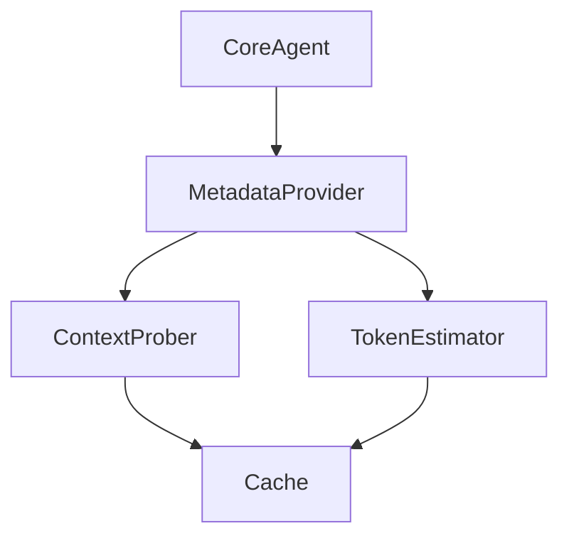

# Hermes Agent Deep Dive

This document provides a comprehensive technical deep dive into the internal architecture and subsystems of Hermes Agent v0.14.0.

## Agent Loop Internals: `run_conversation` Flow in Hermes Agent v0.14.0

The `run_conversation` function serves as the fundamental execution core of the Hermes Agent, orchestrating the entire conversational lifecycle. At approximately 3,900 lines in the v0.14.0 codebase, it is a complex, finely-tuned event-driven loop that handles asynchronous message processing, multi-turn dialogue management, action dispatch, and state persistence. This section presents a deep dive into its architecture, flow control, and key internal mechanisms.

### Architectural Overview

`run_conversation` functions as a coroutine-based event loop, continuously processing incoming messages and system events. It bridges the gap between user input, dialogue management, natural language understanding (NLU), natural language generation (NLG), and backend action execution. The function is responsible for:

- Parsing and validating incoming message envelopes.
- Invoking NLU pipelines to extract intents and entities.
- Managing dialogue context and state transitions.
- Executing side effects and actions via pluggable handlers.
- Coordinating asynchronous responses and streaming partial outputs.
- Updating conversation state persistence in the storage backend.

The design embraces a modular pipeline model, with extensible hooks for custom NLU components, policies, and action handlers.

---

### Core Control Flow and State Machine

At its heart, `run_conversation` employs a state machine to manage conversation phases. The main states include:

- **Receive**: Await and parse the next user or system message.
- **Interpret**: Run the message through the NLU pipeline (`nlu.process()`), producing an `NLUResult`.
- **Decide**: Apply dialogue policies and rules to determine the next system action.
- **Act**: Execute the decided action, which may be an utterance, API call, or state update.
- **Respond**: Send generated responses back to the client or channel.
- **Persist**: Commit updated conversation state to durable storage.
- **Wait**: Pause for asynchronous events (e.g., external action completion).

Each iteration of the loop advances the conversation state machine, often asynchronously with `async/await` semantics to avoid blocking the event loop.

```python
async def run_conversation(conversation_id: str):
    context = await load_context(conversation_id)
    while True:
        message = await receive_message(conversation_id)
        nlu_result = await nlu.process(message)
        next_action = decide_next_action(context, nlu_result)
        response = await execute_action(next_action, context)
        await send_response(conversation_id, response)
        await persist_context(conversation_id, context)
        if next_action.is_terminal:
            break
```

This simplified snippet abstracts the core phases; the actual implementation includes sophisticated error handling, concurrency controls, and incremental output streaming.

---

### Message Handling and Event Loop Integration

`run_conversation` is tightly integrated with Hermes Agent’s asynchronous messaging infrastructure. Messages arrive as protobuf envelopes over various transports (HTTP, WebSocket, MQTT). Upon receipt, the message is:

1. **Validated**: Schema checks ensure envelope integrity.
2. **Deserialized**: Payloads are parsed into internal message objects.
3. **Normalized**: Text normalization and metadata augmentation (e.g., timestamps, user ID extraction).
4. **Queued**: Messages enter an internal priority queue for processing.

The event loop uses Python’s `asyncio` primitives such as `asyncio.Queue` and `asyncio.Event` to coordinate concurrent message intake and processing without race conditions.

```python
receive_queue: asyncio.Queue = asyncio.Queue(maxsize=100)

async def receive_message(conversation_id: str) -> Message:
    while True:
        envelope = await receive_queue.get()
        if envelope.conversation_id == conversation_id:
            return parse_message(envelope)
```

---

### Dialogue Context and State Persistence

Maintaining an accurate conversation context is critical. The context object encapsulates:

- User profile and session variables.
- Dialogue history (user and system turns).
- Slot values and entity bindings.
- Pending actions or events.

`run_conversation` updates this context at every step and persists it using an abstracted storage interface (`context_store`) supporting pluggable backends (e.g., Redis, PostgreSQL).

State persistence is transactional and atomic to prevent data loss or race conditions during concurrent conversations. Hermes employs optimistic concurrency control with version tokens embedded in the context metadata.

```python
async def persist_context(conversation_id: str, context: ConversationContext):
    version_token = context.metadata.version
    success = await context_store.save(conversation_id, context, version_token)
    if not success:
        # Conflict detected, reload and reconcile
        fresh_context = await context_store.load(conversation_id)
        reconcile_context(fresh_context, context)
```

---

### Action Execution and Side Effects

Actions triggered by `run_conversation` span a wide range:

- Textual responses via NLG.
- External API calls (e.g., database queries, service integrations).
- Asynchronous callbacks and deferred events.

The action execution subsystem employs an extensible registry pattern, mapping action names to handler coroutines. These handlers can emit partial responses streamed back to the user, allowing low-latency feedback in long-running operations.

```python
action_registry = {
    "utter_greet": utter_greet_action,
    "fetch_user_data": fetch_user_data_action,
    # ...
}

async def execute_action(action: Action, context: ConversationContext):
    handler = action_registry.get(action.name)
    if handler is None:
        raise UnknownActionError(action.name)
    return await handler(action.params, context)
```

---

### Incremental Output and Streaming

`run_conversation` supports streaming partial responses to clients using asynchronous generators. This is essential for large or multi-part replies (e.g., search results, multi-turn clarifications). The loop yields control back to the transport layer with partial payloads as they become available.

```python
async def execute_action(...):
    async for chunk in handler(...):
        yield chunk
```

This streaming model improves perceived responsiveness and enables real-time conversational experiences.

---

### Summary

The `run_conversation` function is the linchpin of Hermes Agent’s conversational intelligence. Its 3,900-line implementation reflects a robust, asynchronous, stateful event loop managing complex dialogue orchestration with modular components and pluggable extensibility. Understanding its internals is essential for advanced customization, performance tuning, and troubleshooting in production deployments.

## Prompt Assembly Pipeline in Hermes Agent v0.14.0

The Prompt Assembly Pipeline is a core subsystem in Hermes Agent v0.14.0 responsible for constructing richly contextualized prompts tailored for downstream LLM interactions. This pipeline operates as a multi-layered, modular processing chain that dynamically integrates disparate data sources, template logic, and runtime context, ultimately producing the final prompt text. This section details the 10-layer architecture of the prompt assembly pipeline, its internal data flow, and the sophisticated caching strategy employed to optimize performance and maintain prompt consistency.

---

### Architecture Overview: 10 Layers of Prompt Assembly

The prompt assembly pipeline is implemented as a sequential stack of 10 processing layers, each encapsulated as a stateless transformation function. These layers are composed into a pipeline object that manages execution order, error propagation, and caching hooks. The pipeline input is a `PromptContext` object containing user input, session metadata, and environment variables.

The layers and their responsibilities are:

1. **Input Normalization Layer**  
   Normalizes raw user input, trimming whitespace, sanitizing special characters, and enforcing length constraints.  
   ```rust
   fn normalize_input(input: &str) -> String {
       input.trim().replace("\n", " ").chars().take(2048).collect()
   }
   ```

2. **Context Injection Layer**  
   Merges session-level context variables (e.g., user preferences, locale) into the prompt context map.  
   ```rust
   context.insert("locale", session.locale.clone());
   ```

3. **Template Resolution Layer**  
   Selects and loads prompt templates based on request metadata. Templates are stored as parameterized Mustache files with embedded placeholders.  
   ```rust
   let template = template_registry.get_template(context.get("template_id").unwrap());
   ```

4. **Entity Linking Layer**  
   Performs entity extraction and replaces linked entities with enriched representations (e.g., `<USER_NAME>` → `John Doe`). Utilizes an internal NER engine.  
   ```rust
   let entities = ner.extract_entities(&context.input);
   context.replace_entities(entities);
   ```

5. **Dynamic Slot Filling Layer**  
   Populates dynamic slots within templates using API calls or local data queries (e.g., fetching current weather).  
   ```rust
   context.fill_slot("current_weather", weather_api.fetch());
   ```

6. **Prompt Augmentation Layer**  
   Incorporates auxiliary data such as conversation history or related documents to augment prompt context.  
   ```rust
   context.append_history(history_buffer.get_recent(5));
   ```

7. **Security Filtering Layer**  
   Applies content filtering to redact sensitive information or disallowed tokens using regex-based rules.  
   ```rust
   context.redact_sensitive_data();
   ```

8. **Formatting Layer**  
   Converts the fully resolved template and context into a final prompt string, applying consistent formatting such as line wrapping and indentation.  
   ```rust
   let prompt = formatter.format(&template, &context);
   ```

9. **Tokenization & Length Validation Layer**  
   Tokenizes the prompt and enforces token length limits based on target LLM constraints, truncating or splitting as needed.  
   ```rust
   let tokens = tokenizer.tokenize(&prompt);
   if tokens.len() > MAX_TOKENS { tokens.truncate(MAX_TOKENS); }
   ```

10. **Output Packaging Layer**  
    Wraps the final prompt string and metadata (token count, provenance) into a `PromptPayload` object for downstream consumption.  
    ```rust
    PromptPayload { prompt, token_count: tokens.len(), metadata: context.metadata.clone() }
    ```

---

### Caching Strategy

Given the complexity and cost of prompt assembly—especially involving external API calls and entity linking—the Hermes Agent employs a multi-tiered caching system designed for maximum reuse without sacrificing prompt freshness.

#### 1. Layer-Level Memoization

Each layer uses a deterministic cache keyed on its input hash. The caching interface uses a cryptographic hash (SHA256) of the serialized input state to index cached outputs in an in-memory LRU cache (capacity 10,000 entries).

```rust
let input_hash = sha256(serialize(&layer_input));
if let Some(cached_output) = layer_cache.get(&input_hash) {
    return cached_output;
}
// Otherwise, compute output and cache
let output = layer_process(layer_input);
layer_cache.insert(input_hash, output.clone());
output
```

This memoization drastically reduces repeated computation when inputs have not changed, such as repeated prompt generations with identical context.

#### 2. Cross-Layer Incremental Caching

To exploit partial prompt stability, the pipeline uses incremental caching: when a downstream layer hits a cache miss, upstream layers are checked recursively. This allows the pipeline to reuse intermediate results rather than recomputing the entire prompt from scratch.

#### 3. External Data Cache

The Dynamic Slot Filling Layer interacts with external APIs (e.g., weather, knowledge graphs). To avoid excessive API calls, these results are cached with TTL (default 5 minutes) in a Redis-backed distributed cache, keyed by API endpoint and query parameters.

```rust
let cache_key = format!("weather:{}", location);
if let Some(cached_data) = redis.get(&cache_key) {
    return cached_data;
}
let fresh_data = weather_api.fetch(location);
redis.set_ex(&cache_key, fresh_data.clone(), 300);
fresh_data
```

#### 4. Template Cache

Prompt templates are loaded from disk or remote repositories and cached in-memory with file system watchers for invalidation on template file updates. This ensures prompt templates reflect the latest authoring changes without restarting.

---

### Summary

The Hermes Agent v0.14.0 Prompt Assembly Pipeline exemplifies modular, layered design enabling complex prompt construction with efficient caching to meet production SLAs. The 10 distinct layers separate concerns cleanly, while the multi-tiered caching strategy optimizes latency and resource utilization—critical for large-scale, real-time LLM applications. This design facilitates rapid iteration and robust extensibility for future prompt engineering innovations.

## Provider Runtime Resolution in Hermes Agent v0.14.0

In Hermes Agent v0.14.0, **Provider Runtime Resolution** is a critical subsystem responsible for selecting the most appropriate provider instance during runtime and handling failover transparently. This mechanism ensures high availability and resilience in distributed environments where multiple providers may be available for fulfilling the same request.

### Architecture Overview

Hermes Agent supports a pluggable provider model, where each provider implements a specific interface to perform messaging, notification, or data transport tasks. The runtime resolution subsystem dynamically selects among these registered providers based on runtime conditions, configuration policies, and health status.

The core components involved are:

- **Provider Registry**: Maintains a list of all registered providers along with their metadata.
- **Resolver Engine**: Implements the provider selection logic.
- **Health Monitor**: Tracks provider health and readiness.
- **Failover Controller**: Manages retries and fallback to alternate providers.

These components interact as shown in the diagram below:

```
+----------------+       +----------------+       +-----------------+
| Provider       |       | Resolver       |       | Health          |
| Registry       +------>+ Engine         +<----->+ Monitor         |
+----------------+       +----------------+       +-----------------+
                                      |
                                      v
                           +--------------------+
                           | Failover Controller |
                           +--------------------+
                                      |
                                      v
                          +----------------------+
                          | Selected Provider(s)  |
                          +----------------------+
```

### Provider Selection Logic

The **Resolver Engine** operates using a multi-stage decision process:

1. **Filtering**: Providers are filtered based on configuration criteria such as region, protocol support, and version compatibility.

2. **Health Check**: Providers failing health checks (as tracked by the Health Monitor) are excluded.

3. **Priority and Weighting**: Providers are assigned priority levels and weights configured via the agent’s YAML configuration. Higher priority providers are preferred; within the same priority, weighted round-robin selection is applied.

4. **Capability Matching**: For requests with specific capabilities (e.g., encryption, compression), only providers advertising those capabilities are considered.

### Configuration Example

Below is an example snippet from `hermes-agent.yaml` illustrating provider priorities and weights:

```yaml
providers:
  - name: kafka-provider
    priority: 10
    weight: 70
    region: us-east
    capabilities:
      - encryption
  - name: rabbitmq-provider
    priority: 10
    weight: 30
    region: us-east
  - name: kafka-provider-eu
    priority: 5
    weight: 50
    region: eu-west
```

In this example, both `kafka-provider` and `rabbitmq-provider` have equal priority, but Kafka is favored 70% of the time due to weighting. The EU Kafka provider has lower priority and is considered only if US providers are unavailable.

### Failover Mechanism

Failover is orchestrated by the **Failover Controller**, which ensures seamless fallback when the primary provider fails at runtime:

- **Failure Detection**: Providers report failures via exceptions or error codes. The Health Monitor marks providers as unhealthy after configurable thresholds of failure counts or error rates.

- **Retry Logic**: On failure, the Failover Controller attempts a configurable number of retries on the same provider before switching.

- **Provider Switch**: When retries are exhausted or the provider is deemed unhealthy, the Resolver Engine is invoked again to select the next best healthy provider.

- **Exponential Backoff**: Failover retries incorporate exponential backoff to prevent cascading failures under load.

### Runtime Example (Go pseudocode)

```go
func (r *ResolverEngine) SelectProvider(ctx context.Context, cap Capability) (Provider, error) {
    candidates := r.registry.FilterByCapability(cap)
    healthy := r.healthMonitor.FilterHealthy(candidates)
    prioritized := r.applyPriorityAndWeight(healthy)

    for _, provider := range prioritized {
        if err := r.failoverController.TryProvider(ctx, provider); err == nil {
            return provider, nil
        }
        r.healthMonitor.MarkUnhealthy(provider)
    }
    return nil, errors.New("no healthy providers available")
}

func (f *FailoverController) TryProvider(ctx context.Context, p Provider) error {
    maxRetries := f.config.MaxRetries
    var err error
    for i := 0; i < maxRetries; i++ {
        err = p.Send(ctx)
        if err == nil {
            return nil
        }
        time.Sleep(f.exponentialBackoff(i))
    }
    return err
}
```

### Health Monitoring and Dynamic Updates

Providers’ health statuses are updated dynamically via heartbeat and telemetry data. The Health Monitor leverages asynchronous probes and integrates with internal metrics exporters to adjust provider availability in near real-time.

### Summary

Hermes Agent v0.14.0’s provider runtime resolution subsystem provides a robust, configurable, and dynamic mechanism for selecting providers and performing failover. Its design balances configurability, operational resilience, and performance through prioritized weighted selection, health-aware filtering, and controlled failover retries with backoff. This ensures Hermes can reliably route requests to the best available provider in multi-provider deployments.

## Tool Registry and Dispatch System in Hermes Agent v0.14.0

The Tool Registry and Dispatch System in Hermes Agent v0.14.0 is a critical component designed to manage, categorize, and invoke external tools and internal capabilities seamlessly. This subsystem ensures that the agent can dynamically load, register, and dispatch tool invocations based on user intents, context, and runtime conditions.

### Architectural Overview

At its core, the Tool Registry acts as a centralized directory of all available tools, indexed by unique identifiers and metadata. The Dispatch System consumes this registry to resolve tool invocation requests, route them to the appropriate handlers, and manage execution lifecycles.

The architecture consists of three primary components:

1. **Tool Descriptor and Metadata Layer:** Defines the tool interface and metadata schema.
2. **Tool Registry Manager:** Responsible for registering, deregistering, and querying tools.
3. **Dispatch Engine:** Handles runtime invocation and response management.

These components communicate via well-defined APIs and leverage asynchronous patterns to handle concurrent invocations.

### Tool Descriptor and Metadata Schema

Each tool is described using a strongly typed descriptor object that includes:

- `tool_id` (string): Unique identifier, e.g., `"com.nousresearch.tools.web_scraper"`.
- `name` (string): Human-readable name.
- `version` (semantic versioning string).
- `input_schema` (JSON Schema): Defines expected input parameters.
- `output_schema` (JSON Schema): Defines expected output format.
- `capabilities` (array of strings): Functional tags, e.g., `["scraping", "http"]`.
- `invocation_type` (enum): `"sync"` or `"async"`.
- `handler` (function reference or module path): The callable that executes the tool.

Example descriptor in TypeScript interface form:

```typescript
interface ToolDescriptor {
  tool_id: string;
  name: string;
  version: string;
  input_schema: object;
  output_schema: object;
  capabilities: string[];
  invocation_type: 'sync' | 'async';
  handler: (...args: any[]) => Promise<any> | any;
}
```

### Tool Registry Manager Implementation

The registry maintains an internal `Map<string, ToolDescriptor>` keyed by `tool_id`. This structure allows O(1) lookup for tool dispatching.

```typescript
class ToolRegistry {
  private tools: Map<string, ToolDescriptor> = new Map();

  registerTool(descriptor: ToolDescriptor): void {
    if (this.tools.has(descriptor.tool_id)) {
      throw new Error(`Tool with id ${descriptor.tool_id} already registered.`);
    }
    // Validation of descriptor schemas can be done here
    this.tools.set(descriptor.tool_id, descriptor);
  }

  deregisterTool(tool_id: string): boolean {
    return this.tools.delete(tool_id);
  }

  getTool(tool_id: string): ToolDescriptor | undefined {
    return this.tools.get(tool_id);
  }

  findToolsByCapability(capability: string): ToolDescriptor[] {
    return Array.from(this.tools.values()).filter(tool =>
      tool.capabilities.includes(capability)
    );
  }
}
```

### Dispatch Engine

The dispatch engine is responsible for:

- Resolving the correct tool based on invocation requests.
- Validating input parameters against the tool’s `input_schema` using JSON Schema validation (via `ajv` or similar).
- Invoking the tool handler.
- Validating outputs against the `output_schema`.
- Handling errors and retries.

Example dispatch logic snippet:

```typescript
import Ajv from 'ajv';

class ToolDispatcher {
  private registry: ToolRegistry;
  private ajv: Ajv;

  constructor(registry: ToolRegistry) {
    this.registry = registry;
    this.ajv = new Ajv();
  }

  async dispatch(tool_id: string, input: object): Promise<any> {
    const tool = this.registry.getTool(tool_id);
    if (!tool) {
      throw new Error(`Tool ${tool_id} not found`);
    }

    // Validate input
    const validateInput = this.ajv.compile(tool.input_schema);
    if (!validateInput(input)) {
      throw new Error(`Input validation failed: ${this.ajv.errorsText(validateInput.errors)}`);
    }

    let result;
    try {
      if (tool.invocation_type === 'async') {
        result = await tool.handler(input);
      } else {
        result = tool.handler(input);
      }
    } catch (err) {
      throw new Error(`Tool execution error: ${err.message}`);
    }

    // Validate output
    const validateOutput = this.ajv.compile(tool.output_schema);
    if (!validateOutput(result)) {
      throw new Error(`Output validation failed: ${this.ajv.errorsText(validateOutput.errors)}`);
    }

    return result;
  }
}
```

### Configuration Example

A typical tool registration and invocation might look like this:

```typescript
// Define a simple echo tool
const echoTool: ToolDescriptor = {
  tool_id: 'com.nousresearch.tools.echo',
  name: 'Echo Tool',
  version: '0.1.0',
  input_schema: {
    type: 'object',
    properties: { message: { type: 'string' } },
    required: ['message'],
    additionalProperties: false,
  },
  output_schema: {
    type: 'object',
    properties: { echoedMessage: { type: 'string' } },
    required: ['echoedMessage'],
    additionalProperties: false,
  },
  capabilities: ['echo', 'utility'],
  invocation_type: 'sync',
  handler: ({ message }) => ({ echoedMessage: message }),
};

// Register and dispatch
const registry = new ToolRegistry();
registry.registerTool(echoTool);

const dispatcher = new ToolDispatcher(registry);

(async () => {
  const response = await dispatcher.dispatch('com.nousresearch.tools.echo', { message: 'Hello Hermes' });
  console.log(response); // { echoedMessage: 'Hello Hermes' }
})();
```

### Extensibility and Dynamic Loading

Hermes Agent supports dynamic loading of tool modules at runtime by specifying module paths or URLs in the descriptor’s `handler` field. This enables integration of third-party or custom-developed tools without restarting the agent.

Example dynamic loading snippet (simplified):

```typescript
async function loadToolHandler(modulePath: string): Promise<(...args: any[]) => any> {
  const mod = await import(modulePath);
  if (typeof mod.default !== 'function') {
    throw new Error('Tool module must export a default function');
  }
  return mod.default;
}
```

This pattern allows the Tool Registry Manager to register tools whose handlers are asynchronously resolved from external packages, increasing modularity.

### Summary

The Tool Registry and Dispatch System in Hermes Agent v0.14.0 provides a robust, schema-driven framework for managing and invoking agent tools. By enforcing strict input/output contracts and supporting asynchronous execution, it enables safe, scalable, and extensible integrations critical for complex agent workflows. This system underpins the agent’s ability to orchestrate diverse capabilities while maintaining predictable and auditable behavior.

## Session Storage Internals

Hermes Agent v0.14.0 employs a robust and efficient session storage subsystem built atop SQLite, designed to ensure high-performance persistence, rich query capabilities, and detailed session lineage tracking. This section provides an in-depth technical overview of the SQLite schema, the integration of FTS5 for full-text search, and the lineage model underpinning session relationships.

### SQLite Schema Design

The session data model is primarily captured in a normalized set of tables optimized for both write throughput and query versatility. The core tables include:

- **sessions**: Stores metadata about each conversational session.
- **messages**: Holds individual message records linked to sessions.
- **session_lineage**: Tracks parent-child relationships between sessions for lineage reconstruction.

```sql
CREATE TABLE sessions (
    session_id TEXT PRIMARY KEY,
    user_id TEXT NOT NULL,
    created_at INTEGER NOT NULL,
    updated_at INTEGER NOT NULL,
    status TEXT CHECK(status IN ('active', 'archived', 'expired')) DEFAULT 'active',
    metadata JSON DEFAULT '{}'
);

CREATE TABLE messages (
    message_id TEXT PRIMARY KEY,
    session_id TEXT NOT NULL REFERENCES sessions(session_id) ON DELETE CASCADE,
    sender TEXT CHECK(sender IN ('user', 'agent')) NOT NULL,
    timestamp INTEGER NOT NULL,
    content TEXT NOT NULL,
    embedding BLOB, -- Optional vector embedding for semantic search
    metadata JSON DEFAULT '{}'
);

CREATE TABLE session_lineage (
    session_id TEXT NOT NULL REFERENCES sessions(session_id) ON DELETE CASCADE,
    parent_session_id TEXT REFERENCES sessions(session_id),
    PRIMARY KEY (session_id)
);
```

- `sessions.session_id` is a UUIDv4 string uniquely identifying each session.
- `messages` are linked one-to-many with `sessions`.
- `session_lineage` maintains a strict tree structure, with each session optionally referencing a single parent session, enabling hierarchical session lineage for branching conversations or session forks.

### FTS5 Full-Text Search Integration

To enable full-text search over session messages, Hermes Agent leverages SQLite's FTS5 extension. A dedicated virtual table `messages_fts` mirrors the `content` field of the `messages` table, supporting efficient text queries, phrase matching, and token ranking.

```sql
CREATE VIRTUAL TABLE messages_fts USING fts5(
    content,
    content='messages',
    content_rowid='rowid',
    tokenize = 'porter'
);

-- Trigger to keep FTS index up to date
CREATE TRIGGER messages_ai AFTER INSERT ON messages BEGIN
  INSERT INTO messages_fts(rowid, content) VALUES (new.rowid, new.content);
END;

CREATE TRIGGER messages_ad AFTER DELETE ON messages BEGIN
  DELETE FROM messages_fts WHERE rowid = old.rowid;
END;

CREATE TRIGGER messages_au AFTER UPDATE ON messages BEGIN
  UPDATE messages_fts SET content = new.content WHERE rowid = old.rowid;
END;
```

This setup ensures:

- **Incremental Indexing:** The FTS index stays in sync with insertions, updates, and deletions on the `messages` table via triggers.
- **Porter Stemming Tokenizer:** The `porter` tokenizer normalizes tokens for flexible search (e.g., "running" matches "run").
- **Content Synchronization:** The `content_rowid` linkage ties the virtual FTS table directly to the base `messages` table for join queries.

Typical FTS query example:

```sql
SELECT m.session_id, m.message_id, m.content
FROM messages m
JOIN messages_fts fts ON fts.rowid = m.rowid
WHERE messages_fts MATCH 'error NEAR/3 timeout'
ORDER BY rank;
```

### Session Lineage and Ancestry Tracking

A critical feature of Hermes Agent’s session management is the ability to track session lineage, which is essential for understanding session forks, continuations, or nested conversations.

- **Parent-Child Relationship:** Each session may reference a single `parent_session_id` in the `session_lineage` table.
- **Lineage Tree:** This structure forms a forest of trees, allowing traversal from any session to its root ancestor or down to all descendants.
- **Use Cases:** Session lineage supports features like session resumption, branching dialogue paths, and audit trails of conversation evolution.

To reconstruct full session ancestry, recursive common table expressions (CTEs) are used:

```sql
WITH RECURSIVE ancestry(session_id, parent_session_id) AS (
    SELECT session_id, parent_session_id
    FROM session_lineage
    WHERE session_id = :target_session_id
  UNION ALL
    SELECT sl.session_id, sl.parent_session_id
    FROM session_lineage sl
    JOIN ancestry a ON sl.session_id = a.parent_session_id
)
SELECT session_id FROM ancestry;
```

This query returns all ancestor sessions of a given session, enabling lineage-aware analytics and visualization.

---

### Summary

Hermes Agent v0.14.0’s session storage subsystem is a meticulously engineered SQLite-based solution that balances normalized data modeling with full-text search and hierarchical lineage tracking:

- The **relational schema** supports efficient storage and referential integrity.
- The **FTS5 virtual table** enables performant, flexible text search over message content.
- The **session_lineage table** and recursive queries enable powerful ancestry tracking for complex session workflows.

Together, these components form the backbone of Hermes Agent’s persistent session management, enabling scalable, queryable, and lineage-aware conversational AI experiences.

## Context Compression Algorithms in Hermes Agent v0.14.0

Hermes Agent v0.14.0 employs advanced context compression algorithms tailored specifically for three core data streams: trajectory data, conversation logs, and manual feedback inputs. These compression mechanisms are crucial for maintaining real-time responsiveness and efficient memory footprint while preserving semantic integrity across extended agent interactions. This section provides a detailed technical exploration of the compression algorithms, their architectural integration, and configuration parameters.

### Architectural Overview

The compression subsystem is modularized into three specialized compressors:

- **Trajectory Compressor**: Focuses on spatial-temporal data compression for agent movement and state trajectories.
- **Conversation Compressor**: Targets natural language dialogue history, optimizing for semantic preservation and retrieval efficiency.
- **Manual Feedback Compressor**: Handles operator-provided annotations and corrections, encoding for minimal loss and easy interpretability.

Each compressor implements a shared interface `IContextCompressor` defined as:

```rust
pub trait IContextCompressor {
    fn compress(&self, data: &[u8]) -> Result<Vec<u8>, CompressionError>;
    fn decompress(&self, data: &[u8]) -> Result<Vec<u8>, CompressionError>;
}
```

This design enables interchangeable compression strategies without impacting upstream or downstream components.

---

### Trajectory Compression Algorithm

Trajectory data in Hermes encapsulates agent positional coordinates, velocities, and discrete state transitions sampled at 50Hz. Raw trajectory streams can exceed several megabytes within minutes, necessitating lossy yet accuracy-preserving compression.

Hermes adopts a **Piecewise Linear Approximation (PLA)** combined with **Delta Encoding** and **Zstandard (zstd)** entropy coding:

1. **Delta Encoding**: Successive states are transformed into deltas relative to prior samples, exploiting temporal correlation.
2. **PLA Segmentation**: Segments of trajectory points are approximated using linear interpolation within a configurable error bound `ε`.
3. **Zstd Compression**: The delta-encoded PLA parameters are entropy coded using zstd at compression level 3 for a balance of speed and ratio.

Example PLA parameter serialization after delta encoding:

```rust
struct PlaSegment {
    start_time: u64,
    duration: u32,
    start_pos: [f32; 3],
    velocity: [f32; 3],
}

fn compress_trajectory(points: &[TrajectoryPoint], epsilon: f32) -> Vec<u8> {
    let segments = pla_segment(points, epsilon);
    let delta_encoded = delta_encode_segments(&segments);
    zstd::encode_all(&delta_encoded[..], 3).unwrap()
}
```

### Configuration Example

```toml
[compression.trajectory]
error_bound = 0.05        # Max positional error in meters for PLA
zstd_level = 3            # Compression level
sampling_rate_hz = 50     # Input trajectory sampling rate
```

---

### Conversation Compression Algorithm

The conversation compressor addresses the challenge of storing extended dialog histories with minimal loss of semantic context. Hermes utilizes a hybrid approach combining:

- **Sentence Embedding Quantization**: Each utterance is encoded using pre-trained sentence transformers (e.g., Sentence-BERT), producing 768-dimensional vectors.
- **Product Quantization (PQ)**: Embeddings are compressed using PQ to reduce precision while preserving vector similarity.
- **Token-level Delta Encoding**: For token-level storage, differences between consecutive tokens are delta encoded.
- **Run-Length Encoding (RLE)**: Common repeated tokens (e.g., filler words) are run-length encoded prior to entropy coding.
- **Zstd Compression**: The final binary blob is compressed with zstd at level 5.

This approach enables approximate semantic matching during retrieval while dramatically reducing storage.

Example embedding quantization snippet:

```python
from transformers import SentenceTransformer
import numpy as np

model = SentenceTransformer('all-MiniLM-L6-v2')
embedding = model.encode("Hello, how can I help you?")

# Product Quantization (simplified)
def pq_encode(embedding, codebooks):
    # Split embedding into sub-vectors and quantize each
    subvector_size = embedding.size // len(codebooks)
    codes = []
    for i, cb in enumerate(codebooks):
        subvector = embedding[i*subvector_size:(i+1)*subvector_size]
        code = np.argmin(np.linalg.norm(cb - subvector, axis=1))
        codes.append(code)
    return codes
```

### Configuration Example

```toml
[compression.conversation]
embedding_model = "all-MiniLM-L6-v2"
pq_codebook_size = 256
zstd_level = 5
rle_enabled = true
```

---

### Manual Feedback Compression Algorithm

Manual feedback typically consists of sparse annotations, correction flags, and operator comments. The compression algorithm prioritizes lossless encoding with fast decode speeds.

Hermes employs a **Hybrid JSON + Binary Encoding** scheme:

1. **Schema-based Binary Encoding**: Structured feedback (flags, timestamps) is encoded using Cap’n Proto schemas for compactness.
2. **Delta Timestamp Encoding**: Timestamps encoded as deltas to reduce redundancy.
3. **Gzip Compression**: The combined binary and textual data is compressed using gzip at compression level 6.

Example Cap’n Proto schema (feedback.capnp):

```capnp
struct ManualFeedback {
  timestamp @0 :UInt64;
  flag @1 :Bool;
  comment @2 :Text;
}
```

Rust integration:

```rust
use capnp::serialize_packed;

fn compress_feedback(feedback: &ManualFeedback) -> Vec<u8> {
    let mut buf = Vec::new();
    serialize_packed::write_message(&mut buf, &feedback).unwrap();
    gzip::compress(&buf, 6).unwrap()
}
```

### Configuration Example

```toml
[compression.manual_feedback]
gzip_level = 6
use_capnp = true
```

---

### Summary

Hermes Agent’s context compression algorithms are finely tuned to the characteristics of each data type:

| Data Type       | Compression Technique                                    | Lossiness   | Typical Compression Ratio |
|-----------------|----------------------------------------------------------|-------------|---------------------------|
| Trajectory      | PLA + Delta Encoding + Zstd                              | Controlled lossy (ε-bound) | 10x - 20x                 |
| Conversation    | Embedding PQ + RLE + Token Delta + Zstd                 | Approximate semantic preservation | 15x - 30x                 |
| Manual Feedback | Cap’n Proto + Delta Timestamp + Gzip                    | Lossless    | 5x - 8x                   |

This multi-pronged approach ensures that Hermes Agent maintains a rich contextual memory with minimal latency and resource consumption, facilitating sustained intelligent behavior over long-term deployments.

## Gateway Message Routing in Hermes Agent v0.14.0

The Gateway message routing subsystem in Hermes Agent v0.14.0 is a core architectural component responsible for secure, efficient, and flexible message dispatching between distributed nodes. It employs a combination of session keys for cryptographic isolation, a two-level message guard system for policy enforcement, and a programmable interrupt mechanism to handle asynchronous control flows.

### Architecture Overview

At its core, the Gateway routes messages between external clients and Hermes Agent internal modules, as well as inter-agent communication. The routing path is tightly coupled with security and policy enforcement layers, enabling controlled access and dynamic message manipulation.

```plaintext
[Client] <---> [Gateway] <---> [Internal Modules / Other Agents]
                |           \
          Session Keys     Message Guards
                              |
                        Interrupt System
```

---

### Session Keys: Cryptographic Isolation per Session

Each active session in Hermes Agent is assigned a unique session key derived from the agent's master secret combined with session-specific entropy (e.g., client nonce, timestamp). The session key is used to encrypt and authenticate messages, ensuring confidentiality and integrity across the Gateway boundary.

#### Key Derivation and Management

Session keys are generated using HKDF-SHA256 as follows:

```rust
fn derive_session_key(master_secret: &[u8], session_nonce: &[u8]) -> [u8; 32] {
    use ring::hkdf::{Salt, HKDF_SHA256};
    let salt = Salt::new(HKDF_SHA256, master_secret);
    let prk = salt.extract(session_nonce);
    let okm = prk.expand(&[], hkdf::HKDF_SHA256).expect("HKDF expand failed");
    let mut session_key = [0u8; 32];
    okm.fill(&mut session_key).expect("HKDF fill failed");
    session_key
}
```

Session keys are stored within the Gateway's session manager component and bound to session identifiers. All inbound and outbound messages associated with a session are encrypted/decrypted using this key before routing logic is applied.

---

### Two-Level Message Guard: Policy Enforcement

Hermes Agent introduces a two-level message guard system comprising:

1. **Static Guards (Level 1):** These are predefined, compile-time policy rules that filter or transform messages based on message type, source, and destination. Implemented as a set of Rust traits, static guards prevent unauthorized message types early in the pipeline.

2. **Dynamic Guards (Level 2):** These are runtime-evaluated policies that can inspect message contents, metadata, or agent state. Dynamic guards enable fine-grained control such as rate limiting, content validation, or contextual routing.

#### Static Guard Example

```rust
pub trait StaticMessageGuard {
    fn allow_message(&self, msg_type: MessageType, src: &SessionId, dst: &SessionId) -> bool;
}

struct BasicStaticGuard;

impl StaticMessageGuard for BasicStaticGuard {
    fn allow_message(&self, msg_type: MessageType, src: &SessionId, dst: &SessionId) -> bool {
        // Disallow admin commands from external clients
        if msg_type == MessageType::AdminCommand && !src.is_internal() {
            return false;
        }
        true
    }
}
```

#### Dynamic Guard Example

Dynamic guards are implemented as asynchronous callbacks that can modify or reject a message:

```rust
pub type DynamicGuardCallback = Box<dyn Fn(&mut MessageContext) -> Pin<Box<dyn Future<Output=GuardDecision>>>>;

enum GuardDecision {
    Accept,
    Reject(String),
    Modify(Message),
}

// Example: Rate limiting guard
async fn rate_limit_guard(ctx: &mut MessageContext) -> GuardDecision {
    if ctx.session.rate_limiter.exceeded() {
        GuardDecision::Reject("Rate limit exceeded".to_owned())
    } else {
        GuardDecision::Accept
    }
}
```

The Gateway applies static guards first. If passed, the message proceeds to dynamic guards, allowing runtime policy enforcement before final routing.

---

### Interrupt System: Asynchronous Control Flow

Messages routed through the Gateway can trigger asynchronous control flows via the interrupt system. Interrupts are lightweight hooks that can preempt normal routing to perform tasks such as:

- Session rekeying
- Access revocation
- Message injection or cancellation

#### Interrupt Registration and Handling

Interrupts are registered per session or globally and are invoked when matching conditions are met.

```rust
type InterruptHandler = Box<dyn Fn(&InterruptContext) -> Pin<Box<dyn Future<Output=()>>>>;

struct InterruptManager {
    handlers: HashMap<InterruptType, Vec<InterruptHandler>>,
}

impl InterruptManager {
    async fn trigger(&self, interrupt_type: InterruptType, ctx: &InterruptContext) {
        if let Some(handlers) = self.handlers.get(&interrupt_type) {
            for handler in handlers {
                handler(ctx).await;
            }
        }
    }
}
```

#### Example Use Case: Session Rekey Interrupt

When an internal timer or remote instruction signals a need to rekey the session, the interrupt system activates a handler that safely pauses message routing, generates a new session key, and resumes operations with minimal disruption.

---

### Configuration Example

The Gateway message routing subsystem is highly configurable via YAML-based configuration files:

```yaml
gateway:
  session:
    master_secret: "base64-encoded-secret"
    session_timeout_sec: 3600

  message_guards:
    static:
      - BasicStaticGuard
    dynamic:
      - RateLimitGuard

  interrupts:
    enabled: true
    handlers:
      - SessionRekeyHandler
      - AccessRevocationHandler
```

This configuration enables secure session key management, policy enforcement guards, and the interrupt system for advanced control.

---

### Summary

The Gateway message routing subsystem in Hermes Agent v0.14.0 combines cryptographic session keys, a two-level message guard architecture, and a flexible interrupt system to provide secure, policy-driven, and responsive message handling. By isolating sessions cryptographically and enforcing layered policies before routing, Hermes ensures robust communication in distributed environments while maintaining extensibility through asynchronous interrupts.

## Memory Manager Internals in Hermes Agent v0.14.0

The memory management subsystem in Hermes Agent v0.14.0 represents a critical component designed to balance high-throughput in-memory operations with reliable fault tolerance and efficient long-term data curation. This section provides a deep technical exposition of the core mechanisms: **bounded curation**, **frozen snapshots**, and **disk persistence**, detailing their architecture, data structures, and operational workflows.

### Bounded Curation

Hermes Agent employs a bounded curation strategy to manage memory consumption while ensuring that relevant telemetry and event data remain accessible for real-time querying and anomaly detection.

**Core Concept:**  
Bounded curation imposes hard limits on the in-memory buffer sizes and total data retention duration, preventing unbounded memory growth under high ingestion rates.

- **Buffer Pools:** Data ingestion triggers appending events into a segmented in-memory buffer pool. Each buffer segment is capped at configurable sizes (default 64MB).
- **Time-Windowed Retention:** Data is logically partitioned into time slices. By default, Hermes maintains a sliding window of the last 30 minutes of raw event data.
- **Eviction Policy:** When buffer pools reach configured thresholds, the oldest segments are subject to eviction. Before eviction, data is either persisted to disk (see Disk Persistence) or curated into summarized aggregates.

```rust
struct BufferSegment {
    start_timestamp: u64,
    end_timestamp: u64,
    events: Vec<Event>,
}

impl MemoryManager {
    fn append_event(&mut self, event: Event) {
        let current_segment = self.get_or_create_current_segment();
        current_segment.events.push(event);

        if current_segment.events.len() >= self.segment_max_events {
            self.roll_over_segment();
        }

        if self.total_memory_usage() > self.max_memory_bytes {
            self.evict_oldest_segment();
        }
    }
}
```

This bounded approach ensures the agent can operate under diverse workloads without risking OOM conditions while maintaining a working set of recent data for instantaneous analytics.

### Frozen Snapshots

Frozen snapshots are immutable, read-optimized in-memory structures derived from curated raw data buffers. Their purpose is to provide efficient, consistent views for query engines and downstream consumers without stalling ingestion.

- **Immutability:** Once a snapshot is frozen, it becomes a read-only data structure. This enables lock-free concurrent access patterns.
- **Data Compaction:** During freezing, raw event data is aggregated into columnar layouts optimized for vectorized scans and predicate pushdowns.
- **Versioning and Metadata:** Each snapshot carries metadata including creation timestamp, data range, and a unique snapshot ID to facilitate cache invalidation and incremental queries.

```rust
struct FrozenSnapshot {
    id: SnapshotId,
    created_at: u64,
    columns: Vec<ColumnarData>,
    range_start: u64,
    range_end: u64,
}

impl MemoryManager {
    fn freeze_current_segment(&mut self) -> FrozenSnapshot {
        let segment = self.current_segment.take().expect("No segment to freeze");
        let columns = Self::compact_to_columnar(segment.events);

        FrozenSnapshot {
            id: self.generate_snapshot_id(),
            created_at: Self::current_timestamp(),
            columns,
            range_start: segment.start_timestamp,
            range_end: segment.end_timestamp,
        }
    }
}
```

The frozen snapshots serve as the basis for snapshot-based queries and are also the units persisted to disk, forming the bridge between volatile memory and durable storage.

### Disk Persistence

The persistence layer guarantees durability and supports recovery by serializing frozen snapshots to disk using an append-only log format.

- **Segmented Snapshots on Disk:** Each frozen snapshot is serialized into a separate file chunk with a `.hsnap` extension, stored in a well-defined persistence directory.
- **Serialization Format:** Hermes uses a custom binary format optimized for fast serialization/deserialization and partial loads. Data columns are compressed using LZ4 and indexed for rapid seek.
- **Write-Ahead Logging (WAL):** To guarantee atomicity, snapshots are first written to a temporary file and then atomically renamed upon successful completion.
- **Retention and Cleanup:** A background cleaner process prunes old snapshot files beyond configured retention intervals (default 7 days) to reclaim disk space.

```toml
# hermes_agent.toml
[memory_manager]
max_memory_bytes = 536870912        # 512MB
segment_max_events = 1000000
snapshot_retention_days = 7
persistence_dir = "/var/lib/hermes_agent/snapshots"
```

```rust
impl DiskPersistence {
    fn persist_snapshot(&self, snapshot: &FrozenSnapshot) -> Result<PathBuf, PersistenceError> {
        let temp_path = self.persistence_dir.join(format!("{}.tmp", snapshot.id));
        let final_path = self.persistence_dir.join(format!("{}.hsnap", snapshot.id));

        let mut file = File::create(&temp_path)?;
        serialize_snapshot(&mut file, snapshot)?;

        file.sync_all()?;
        std::fs::rename(temp_path, final_path.clone())?;

        Ok(final_path)
    }
}
```

This architecture ensures that Hermes Agent can recover from crashes by replaying persisted snapshots, while continuing to provide low-latency access to recent telemetry via in-memory frozen snapshots.

---

In summary, Hermes Agent’s **Memory Manager** tightly integrates bounded in-memory buffering with immutable frozen snapshots and a robust disk persistence pipeline. This design simultaneously addresses performance, consistency, and durability requirements critical to large-scale telemetry ingestion and analysis workloads.

## Skill Manager Internals in Hermes Agent v0.14.0

The Skill Manager subsystem in Hermes Agent v0.14.0 is a critical component responsible for discovering, loading, managing provenance, and tracking usage analytics of conversational skills. This section presents an in-depth technical exploration of this subsystem, including its architecture, internal workflows, and configuration nuances.

### Architecture Overview

The Skill Manager acts as the intermediary between the Hermes core and the individual skill modules. It consists of four tightly integrated components:

- **Discovery Engine**: Locates available skills on the filesystem or registered repositories.
- **Loader**: Dynamically loads skill modules into the runtime environment.
- **Provenance Tracker**: Maintains metadata about skill origin, versioning, and trust.
- **Usage Analytics Collector**: Records invocation patterns and performance metrics.

These components communicate internally through event-driven interfaces leveraging the Hermes internal event bus, ensuring loose coupling and extensibility.

### Skill Discovery

The discovery process is orchestrated by the `SkillDiscoveryService`. It supports multi-source discovery:

1. **Local Filesystem**: Scans configured skill directories recursively for skill manifests (`skill.yaml` or `skill.json`).
2. **Remote Registries**: Queries HTTP/HTTPS skill registries implementing the Hermes Registry API.
3. **Containerized Skills**: Optionally discovers skills packaged as OCI containers registered in a local container registry.

#### Discovery Algorithm

```python
def discover_skills(sources: List[Source]) -> List[SkillManifest]:
    discovered = []
    for source in sources:
        if isinstance(source, LocalDirectory):
            discovered.extend(scan_local_directory(source.path))
        elif isinstance(source, RemoteRegistry):
            discovered.extend(fetch_registry_skills(source.endpoint))
        elif isinstance(source, ContainerRegistry):
            discovered.extend(list_container_skills(source.registry_url))
    return discovered
```

Each discovered skill is validated against a schema defined in `skill_schema.json` to ensure manifest integrity before loading.

### Skill Loading

The `SkillLoader` dynamically loads skill modules using Python’s importlib machinery combined with sandboxing measures to isolate skill execution contexts. Skills are loaded into separate Python sub-interpreters (using `Py_NewInterpreter`) where supported, or alternatively encapsulated within proxied processes.

Configuration example for loading paths:

```yaml
skill_manager:
  skill_paths:
    - /opt/hermes/skills
    - /home/user/.hermes/skills
  enable_sandboxed_loading: true
```

Loading steps:

1. Resolve skill dependencies declared in the manifest.
2. Create isolated execution context.
3. Import skill entrypoint module and instantiate skill class.
4. Register the skill with the central event bus.

Example loader snippet:

```python
def load_skill(manifest: SkillManifest):
    context = create_sandbox_context(manifest)
    module = importlib.util.module_from_spec(
        importlib.util.spec_from_file_location(manifest.entrypoint, manifest.entrypoint_path)
    )
    context.exec_module(module)
    skill_instance = module.Skill()
    register_skill(skill_instance)
```

### Provenance Tracking

Provenance tracking is essential for security, auditability, and trust management. Each skill manifest includes fields such as:

- `origin_url`: Source repository or registry URL.
- `commit_hash`: Git commit or artifact hash.
- `signature`: Cryptographic signature of the manifest.

The `ProvenanceTracker` maintains a local provenance database (`provenance.db` using SQLite) mapping skill IDs to metadata and verification status. Upon skill loading, the tracker verifies signatures using configured public keys.

Schema excerpt for provenance DB:

```sql
CREATE TABLE skill_provenance (
    skill_id TEXT PRIMARY KEY,
    origin_url TEXT,
    commit_hash TEXT,
    signature BLOB,
    verified INTEGER,
    last_verified TIMESTAMP
);
```

Verification workflow:

1. Extract signature and public key reference from manifest.
2. Validate manifest hash and signature.
3. Update verification status and timestamps in the provenance DB.

### Usage Analytics

The `UsageAnalyticsCollector` gathers metrics related to skill invocations, including:

- Invocation count and frequency.
- Execution latency.
- Success/failure rates.
- User interaction context metadata (e.g., user IDs, session IDs).

This data is aggregated asynchronously and stored in a time-series database (e.g., InfluxDB) or local JSON log files depending on the deployment configuration.

Example configuration:

```yaml
usage_analytics:
  backend: influxdb
  influxdb:
    url: http://localhost:8086
    database: hermes_analytics
    retention_policy: "30d"
```

Instrumentation within skill invocation lifecycle:

```python
start_time = time.monotonic()
try:
    result = skill.handle_intent(intent)
    success = True
except Exception:
    success = False
finally:
    duration = time.monotonic() - start_time
    analytics_collector.record(
        skill_id=skill.id,
        intent=intent.name,
        duration=duration,
        success=success
    )
```

The Skill Manager exposes an API for querying aggregated analytics, enabling adaptive skill prioritization and operational monitoring.

---

In summary, the Skill Manager in Hermes Agent v0.14.0 employs a sophisticated modular design combining declarative discovery, secure dynamic loading, immutable provenance tracking, and rich usage analytics. This design enables robust, secure, and observable management of conversational skills in production deployments.

## Error Classifier: FailoverReason Enum and API Error Parsing

The Error Classifier subsystem in Hermes Agent v0.14.0 is a critical component designed to systematically categorize API call failures, enabling robust failover strategies and precise telemetry. This section provides a comprehensive deep dive into the internal mechanics of the `FailoverReason` enum and the API error parsing logic that underpins the classifier.

### Overview

Hermes Agent interacts with multiple downstream services and APIs, each of which can fail for myriad reasons ranging from transient network issues to authorization problems or rate limiting. The Error Classifier encapsulates these failure modes into a structured representation, primarily through the `FailoverReason` enum. This allows the agent to implement fine-grained failover policies and granular monitoring.

### FailoverReason Enum

At the core of the Error Classifier is the `FailoverReason` enum, defined in `src/errors/failover_reason.rs`. It enumerates all known failure categories that Hermes Agent recognizes when an API request fails. This enum is designed to be extensible for future failure types and integrates seamlessly with the agent’s telemetry and retry subsystems.

```rust
/// Enum representing classified reasons for API failover.
#[derive(Debug, Clone, Copy, PartialEq, Eq, Hash)]
pub enum FailoverReason {
    /// Network connectivity issues (e.g., DNS failure, TCP timeout).
    NetworkFailure,
    /// HTTP 5xx server errors indicating temporary service problems.
    ServerError,
    /// HTTP 429 Too Many Requests (rate limiting).
    Throttling,
    /// Authentication or authorization failures (e.g., HTTP 401, 403).
    AuthenticationFailure,
    /// Client-side request errors (e.g., HTTP 400, malformed request).
    ClientError,
    /// Request timed out before completion.
    Timeout,
    /// Unknown or uncategorized error.
    Unknown,
}
```

Each variant corresponds to a distinct failover trigger that drives the agent’s retry and failover logic.

### API Error Parsing Logic

The error parsing pipeline is implemented primarily in `src/errors/error_parser.rs`. This module consumes raw HTTP responses and error metadata, then maps them to a `FailoverReason`. The parsing logic uses a layered approach:

1. **HTTP Status Code Analysis:** The initial discriminator is the HTTP status code. For example:
   - `500-599` → `ServerError`
   - `429` → `Throttling`
   - `401, 403` → `AuthenticationFailure`
   - `400-499` (excluding 401,403,429) → `ClientError`

2. **Error Message and Header Inspection:** For ambiguous cases (e.g., network timeouts or proxy errors), the parser inspects error strings and HTTP headers to detect network failures or timeouts.

3. **Timeout Detection:** Timeouts are detected both via explicit timeout errors returned by the HTTP client layer (e.g., `tokio::time::Elapsed`) and by interpreting custom headers like `X-Request-Timeout`.

4. **Fallback to Unknown:** If no known pattern matches, the error classifier returns `FailoverReason::Unknown`.

#### Parsing Function Example

```rust
/// Parses an API error response and maps it to a FailoverReason.
pub fn classify_error(status_code: Option<u16>, error_message: Option<&str>, headers: &HeaderMap) -> FailoverReason {
    match status_code {
        Some(code) if (500..600).contains(&code) => FailoverReason::ServerError,
        Some(429) => FailoverReason::Throttling,
        Some(401) | Some(403) => FailoverReason::AuthenticationFailure,
        Some(code) if (400..500).contains(&code) => FailoverReason::ClientError,
        _ => {
            if let Some(msg) = error_message {
                if msg.contains("timeout") {
                    return FailoverReason::Timeout;
                }
                if msg.contains("connection refused") || msg.contains("network unreachable") {
                    return FailoverReason::NetworkFailure;
                }
            }
            // Inspect headers for timeout indicators
            if headers.get("X-Request-Timeout").is_some() {
                return FailoverReason::Timeout;
            }
            FailoverReason::Unknown
        }
    }
}
```

### Integration with Hermes Agent

The Error Classifier is invoked immediately upon receiving an error response from any downstream API call. The classification result populates the request context, drives retry policies, and is emitted as part of Hermes Agent’s telemetry events (see `src/telemetry/events.rs`).

For example, if an API call returns HTTP 429, the classifier returns `FailoverReason::Throttling`, triggering an exponential backoff before retry. If a network failure is detected, the failover logic may attempt a secondary endpoint.

### Configuration Example

In Hermes Agent’s configuration YAML, failover policies are tied to `FailoverReason` values, allowing operators to customize behaviors:

```yaml
failover:
  policies:
    NetworkFailure:
      max_retries: 5
      backoff_strategy: exponential
    Throttling:
      max_retries: 3
      backoff_strategy: fixed
      backoff_delay_ms: 2000
    AuthenticationFailure:
      max_retries: 0
      alert: true
```

This declarative association ensures the Error Classifier directly influences runtime failover behavior.

---

By providing a deterministic and extensible classification system, the Error Classifier subsystem enables Hermes Agent to respond intelligently to diverse failure modes with minimal operator intervention. The `FailoverReason` enum and API error parsing logic are foundational to this capability in v0.14.0.

## Model Metadata System: Context Probing and Token Estimation

The Model Metadata System in Hermes Agent v0.14.0 is a critical subsystem designed to abstract and manage model-specific parameters, capabilities, and constraints. It enables dynamic adaptation of the agent’s behavior according to the target language model's internal properties, facilitating robust and optimized prompt engineering, token budgeting, and context management. Two of the core functionalities within this system are **context probing** and **token estimation**, which together provide Hermes Agent with precise control over model interaction boundaries.

### Architecture Overview

The Model Metadata System sits between the Hermes Agent’s core orchestration layer and the language model API adapters. Its architecture follows a modular design:

- **Metadata Provider Interface:** Abstracts model-specific metadata retrieval, either via static manifests or dynamic introspection.
- **Context Prober Module:** Implements probing algorithms to discover the effective context window size of a model.
- **Token Estimator Module:** Provides tokenization-based estimations leveraging model-specific tokenizer implementations.
- **Cache Layer:** Persists metadata and probe results for performance and consistency.



### Context Probing

Many language models, especially proprietary APIs, do not expose reliable context window sizes or may have variable limits depending on usage tiers or configurations. The context prober addresses this uncertainty via a heuristic-driven probing protocol:

1. **Incremental Context Injection:** The prober submits test prompts with incrementally larger token payloads.
2. **Response Validation:** It inspects model responses for truncation signals or explicit errors indicating context overflow.
3. **Binary Search Optimization:** To minimize API calls, a binary search strategy efficiently narrows down the maximum token context size.

#### Probing Implementation (Simplified)

```python
class ContextProber:
    def __init__(self, model_api, max_probe_tokens=32768):
        self.model_api = model_api
        self.max_probe_tokens = max_probe_tokens

    def probe_context_size(self):
        low, high = 1, self.max_probe_tokens
        max_context = 0

        while low <= high:
            mid = (low + high) // 2
            prompt = "a" * mid  # simplistic payload of 'a's

            try:
                response = self.model_api.send_prompt(prompt)
                if self._response_indicates_truncation(response):
                    high = mid - 1
                else:
                    max_context = mid
                    low = mid + 1
            except ModelContextError:
                high = mid - 1

        return max_context

    def _response_indicates_truncation(self, response):
        # Heuristic: check for partial completions, error flags, or warnings
        return "truncated" in response.metadata.get("warnings", [])
```

The probing process is performed once per model configuration and cached to avoid redundant API calls during runtime.

### Token Estimation

Token estimation is essential for prompt composition, cost forecasting, and context budget management. Hermes Agent implements a token estimation system tightly coupled with the tokenizer corresponding to each supported model.

- **Tokenizer Abstraction:** Supports BPE, SentencePiece, and proprietary tokenizers, each encapsulated behind a common interface.
- **Token Cost Calculation:** Estimates tokens for arbitrary input strings, including special tokens, delimiters, and stop sequences.
- **Dynamic Token Counting:** Supports incremental token counting for streaming or partial prompt assembly.

#### Token Estimator Interface

```python
class TokenEstimator:
    def __init__(self, tokenizer):
        self.tokenizer = tokenizer

    def estimate_tokens(self, text: str) -> int:
        tokens = self.tokenizer.encode(text)
        return len(tokens)

    def estimate_prompt_tokens(self, prompt_parts: List[str]) -> int:
        tokens = 0
        for part in prompt_parts:
            tokens += len(self.tokenizer.encode(part))
        return tokens
```

### Configuration Example

The model metadata system is configured per model in the `models.yaml` manifest file, specifying tokenizer types and context probing parameters:

```yaml
gpt-4:
  tokenizer_type: tiktoken
  max_context_hint: 8192
  context_probing:
    enabled: true
    max_probe_tokens: 16384
  token_estimation:
    stop_sequences: ["\n\n", ""]
```

### Integration with Hermes Agent Core

During agent initialization, the Model Metadata System performs the following:

- Loads static metadata from manifests.
- If enabled, executes context probing for precision.
- Instantiates the appropriate tokenizer and token estimator.
- Provides token budget and context window details to the prompt construction engine.

This metadata-driven approach allows Hermes Agent to adapt prompt length and token usage dynamically, avoiding costly API errors due to context overruns and enabling accurate cost and latency predictions.

---

In summary, the Model Metadata System's context probing and token estimation modules provide Hermes Agent with a robust foundation for model-aware prompt engineering, ensuring optimal utilization of model capabilities while respecting operational constraints. This subsystem is fundamental for scaling Hermes Agent's multi-model orchestration with precision and efficiency.

## Rate Limit Tracking: Nous Rate Guard and Jittered Backoff in Hermes Agent v0.14.0

Hermes Agent v0.14.0 introduces a robust and fine-grained rate limit tracking subsystem, centered around the **Nous Rate Guard** mechanism, augmented by an adaptive **jittered backoff strategy**. This subsystem is critical for maintaining compliance with upstream API rate limits, ensuring stable operational throughput while avoiding throttling penalties and cascading failures.

### Architecture Overview

The rate limit tracking subsystem is architected as a modular, pluggable middleware within Hermes Agent’s outbound request pipeline. It operates transparently between the request generation layer and the HTTP transport layer, intercepting and analyzing rate limit-related response headers and metrics.

The core components are:

- **Rate Limit State Store**: An in-memory, lock-free concurrent map keyed by API endpoint and HTTP method, storing current rate limit counters and reset timestamps.
- **Nous Rate Guard Controller**: The decision engine that evaluates if a request should be dispatched immediately, delayed, or rejected outright based on current quotas.
- **Jittered Backoff Scheduler**: A timer-driven mechanism that dynamically computes retry intervals with randomized jitter to prevent thundering herd problem.

### Nous Rate Guard: Fine-grained Quota Management

The Nous Rate Guard relies on parsing standard and custom rate limit headers such as:

- `X-RateLimit-Limit`
- `X-RateLimit-Remaining`
- `X-RateLimit-Reset`
- Custom headers like `X-Nous-Limit-Policy`

Upon receiving a response, the agent invokes the guard’s `updateRateLimitState()` method, which atomically updates the state store. For example:

```go
type RateLimitKey struct {
    Endpoint string
    Method   string
}

type RateLimitState struct {
    Limit     int
    Remaining int
    Reset     time.Time
    mu        sync.Mutex
}

func (nrg *NousRateGuard) updateRateLimitState(key RateLimitKey, headers http.Header) {
    nrg.stateStore[key].mu.Lock()
    defer nrg.stateStore[key].mu.Unlock()

    limit, _ := strconv.Atoi(headers.Get("X-RateLimit-Limit"))
    remaining, _ := strconv.Atoi(headers.Get("X-RateLimit-Remaining"))
    resetSec, _ := strconv.ParseInt(headers.Get("X-RateLimit-Reset"), 10, 64)
    resetTime := time.Unix(resetSec, 0)

    state := nrg.stateStore[key]
    state.Limit = limit
    state.Remaining = remaining
    state.Reset = resetTime
}
```

Before dispatching a request, the guard performs a check with `allowRequest()`:

```go
func (nrg *NousRateGuard) allowRequest(key RateLimitKey) bool {
    state := nrg.stateStore[key]
    state.mu.Lock()
    defer state.mu.Unlock()

    now := time.Now()
    if now.After(state.Reset) {
        // Reset counters on expiry
        state.Remaining = state.Limit
    }

    if state.Remaining > 0 {
        state.Remaining -= 1
        return true
    }
    return false
}
```

This strict enforcement ensures no requests are sent when the quota is exhausted, thereby preventing rate limit violations.

### Jittered Backoff: Adaptive Retry Scheduling

When a request is rate-limited, Hermes Agent triggers the jittered backoff scheduler, which delays retries with increasing intervals randomized by a jitter factor to avoid synchronized retries.

The backoff interval `t_n` for the nth retry is computed as:

```
t_n = base * 2^n * (1 + jitter * (rand.Float64()*2 - 1))
```

Where:

- `base` is the initial backoff duration (e.g., 500ms)
- `jitter` is a configurable fraction (e.g., 0.3)
- `rand.Float64()` generates a uniform random number in [0,1)

Example backoff calculation:

```go
func jitteredBackoff(base time.Duration, retries int, jitter float64) time.Duration {
    exp := float64(1 << retries) // 2^retries
    jitterFactor := 1 + jitter*(rand.Float64()*2-1)
    backoff := time.Duration(float64(base) * exp * jitterFactor)
    if backoff < 0 {
        backoff = base // fallback to base if jitter causes negative
    }
    return backoff
}
```

The scheduler enqueues the request to be retried after the computed delay. This approach mitigates the **thundering herd** problem common in distributed systems where multiple agents retry simultaneously after a rate limit reset.

### Configuration Example

The rate limit tracking subsystem is configurable via the Hermes Agent configuration YAML:

```yaml
nous_rate_guard:
  enabled: true
  base_backoff_ms: 500
  max_retries: 5
  jitter_fraction: 0.3
  endpoints:
    - path: /api/v1/messages
      method: POST
      limit_header: X-RateLimit-Limit
      remaining_header: X-RateLimit-Remaining
      reset_header: X-RateLimit-Reset
```

This config allows per-endpoint tuning of the rate guard parameters, enabling Hermes Agent to adapt to diverse upstream rate limiting policies.

---

In summary, the Hermes Agent v0.14.0 rate limit tracking subsystem leverages the Nous Rate Guard’s precise quota accounting combined with an intelligent jittered backoff retry strategy. This design ensures high reliability and compliance in high-throughput API integrations, minimizing request failures and maintaining throughput under strict rate limiting constraints.

## Credential Pool Architecture in Hermes Agent v0.14.0

The Credential Pool subsystem in Hermes Agent v0.14.0 is a core component designed to manage and distribute ephemeral and persistent credentials efficiently across multiple agent components. This subsystem addresses the challenges of credential reuse, rotation, and concurrency in large-scale, multi-tenant environments where secure, high-throughput access to secrets is critical.

### Overview

At a high level, the Credential Pool acts as a centralized in-memory cache and lifecycle manager for credentials retrieved from external secret stores (e.g., AWS Secrets Manager, HashiCorp Vault, Azure Key Vault). It abstracts the complexity of credential fetching, renewal, and expiry handling, exposing a simple interface for other Hermes Agent modules to acquire and release credentials without incurring high latency or risking stale secrets.

### Architectural Components

The Credential Pool architecture is composed of three primary components:

1. **Credential Cache Layer**
2. **Credential Fetcher and Refresher**
3. **Pool Manager and Lease Tracker**

---

### 1. Credential Cache Layer

This is a thread-safe, in-memory map keyed by a composite identifier `{credential_source, credential_id, scope}`. The scope defines the isolation boundary (e.g., tenant ID or cluster namespace). The cache entries store `CredentialEntry` objects which hold the secret data, metadata (such as creation and expiry timestamps), and current lease count.

```go
type CredentialEntry struct {
    SecretData    []byte
    CreatedAt     time.Time
    ExpiresAt     time.Time
    LeaseCount    int32 // atomic counter
    RefreshMutex  sync.Mutex
}
```

The cache is implemented using a `sync.Map` for concurrent access with minimal locking overhead. Entry lease counting is handled via atomic operations to allow multiple consumers to concurrently hold references to the same credential without unnecessary duplication.

---

### 2. Credential Fetcher and Refresher

This component handles on-demand fetching of credentials from configured secret backends and proactively refreshes credentials nearing expiry. The fetcher interface is pluggable, supporting multiple secret providers.

```go
type CredentialFetcher interface {
    Fetch(ctx context.Context, source string, id string, scope string) (*CredentialEntry, error)
    Refresh(ctx context.Context, entry *CredentialEntry) (*CredentialEntry, error)
}
```

The refresh logic is governed by a configurable threshold — by default, credentials are refreshed when they reach 20% of their TTL remaining. The refresh process is synchronized via the `RefreshMutex` on the `CredentialEntry`, ensuring only one goroutine performs the refresh to avoid stampeding.

Example refresh condition check:

```go
func (e *CredentialEntry) NeedsRefresh() bool {
    ttl := e.ExpiresAt.Sub(e.CreatedAt)
    remaining := e.ExpiresAt.Sub(time.Now())
    return remaining < (ttl / 5) // refresh if less than 20% TTL left
}
```

---

### 3. Pool Manager and Lease Tracker

The Pool Manager is responsible for:

- Granting leases on credentials to consumers.
- Tracking active leases to prevent premature eviction.
- Cleaning up expired or unused credentials.

When a consumer requests a credential, the Pool Manager:

1. Looks up the credential in the cache.
2. If not present or expired, invokes the Fetcher to retrieve a fresh credential.
3. Increases the lease count atomically.
4. Returns a lease handle which the consumer must release when done.

```go
type CredentialLease struct {
    Entry *CredentialEntry
    pool  *CredentialPool
}

func (l *CredentialLease) Release() {
    atomic.AddInt32(&l.Entry.LeaseCount, -1)
}
```

The pool runs a background eviction routine that periodically scans the cache for entries where:

- `ExpiresAt < now`
- `LeaseCount == 0`

These entries are safely removed from the cache to free memory.

---

### Configuration Example

The following YAML excerpt demonstrates configuring the Credential Pool behavior within Hermes Agent's `agent.yaml`:

```yaml
credential_pool:
  refresh_threshold_pct: 20    # Refresh if <20% TTL remaining
  eviction_interval_sec: 60    # Run eviction every 60 seconds
  max_cache_size: 1000         # Max number of cached credentials
  secret_providers:
    - name: aws_secrets_manager
      region: us-east-1
    - name: vault
      address: https://vault.example.com
      role: hermes-agent
```

---

### Conclusion

The Credential Pool architecture in Hermes Agent v0.14.0 strikes a balance between performance, security, and scalability. By decoupling credential fetching from usage and implementing a robust lease and refresh mechanism, it ensures that consumers receive fresh credentials with minimal latency, while preventing unnecessary load on external secret managers. This architecture is critical for Hermes Agent’s role in orchestrating secure, dynamic access to secrets in cloud-native environments.

## Background Review System in Hermes Agent v0.14.0: Post-Turn Hooks and Memory/Skill Nudges

The Background Review System in Hermes Agent v0.14.0 is a critical enhancement designed to enable continuous context refinement and dynamic skill activation based on conversation progression. Unlike traditional stateless chatbot architectures, Hermes incorporates post-turn hooks to perform asynchronous background evaluations, triggering memory and skill nudges that enrich dialogue coherence and responsiveness.

### Architecture Overview

At its core, the Background Review System operates as an event-driven submodule within the Hermes Agent runtime, tightly integrated with the core dialogue manager and memory subsystem. After each user-agent interaction turn, the system invokes a configurable set of post-turn hooks that analyze the latest conversation state snapshot. These hooks execute asynchronously to avoid blocking the main dialogue flow, ensuring minimal latency impact.

The key components involved are:

- **Post-Turn Hook Manager:** Coordinates execution of registered hooks, manages hook lifecycle, and collates their outputs.
- **Memory Nudge Engine:** Applies context refinement by injecting or updating episodic and semantic memory fragments based on hook analysis.
- **Skill Nudge Controller:** Dynamically activates or adjusts skill modules (e.g., knowledge retrieval, sentiment analysis) in response to conversation cues detected post-turn.

### Post-Turn Hooks: Design and Implementation

Post-turn hooks are implemented as pluggable Python coroutines following the interface:

```python
class PostTurnHook(ABC):
    @abstractmethod
    async def run(self, dialogue_state: DialogueState) -> Optional[HookResult]:
        pass
```

Each hook receives a fully hydrated `DialogueState` object encapsulating the entire conversation history, current turn metadata, and agent internal states. Hooks perform arbitrary analysis, such as keyword detection, sentiment drift measurement, or external API calls for knowledge updates.

For example, a hook detecting topic shifts might be implemented as:

```python
class TopicShiftDetectionHook(PostTurnHook):
    async def run(self, dialogue_state: DialogueState) -> Optional[HookResult]:
        last_user_utterance = dialogue_state.get_last_user_utterance()
        if self._detect_topic_shift(last_user_utterance):
            return HookResult(
                action="memory_nudge",
                payload={"topic": last_user_utterance.topic}
            )
        return None

    def _detect_topic_shift(self, utterance: Utterance) -> bool:
        # Implement statistical or ML-based detection logic here
        pass
```

Hooks return a `HookResult` object that signals the type of nudge or system action to perform.

### Memory Nudges

Memory nudges enable the system to proactively update or augment internal memory stores based on emergent context. When a post-turn hook returns a `HookResult` with `action="memory_nudge"`, the Memory Nudge Engine interprets the payload to adjust relevant memory entries.

Hermes supports two primary memory types:

- **Episodic Memory:** Transient contextual snapshots specific to a conversation session.
- **Semantic Memory:** Persistent knowledge representations maintained across sessions.

Memory nudges may, for example, insert inferred user intents or update user preferences dynamically:

```python
class MemoryNudgeEngine:
    def apply_nudge(self, nudge_payload: Dict[str, Any], memory_store: MemoryStore):
        topic = nudge_payload.get("topic")
        if topic:
            memory_store.update_episodic_memory({"current_topic": topic})
```

This dynamic memory adjustment ensures subsequent dialogue turns incorporate refined context, improving relevance and coherence.

### Skill Nudges

Skill nudges dynamically modulate the invocation and parameterization of modular skills within Hermes. Post-turn hooks may detect triggers necessitating activating specialized capabilities, e.g., sentiment-aware response generation or external knowledge base querying.

Skill nudges leverage the Skill Nudge Controller, which interfaces with Hermes’ skill orchestration layer:

```python
class SkillNudgeController:
    def apply_nudge(self, nudge_payload: Dict[str, Any], skill_manager: SkillManager):
        skill_name = nudge_payload.get("skill_name")
        parameters = nudge_payload.get("parameters", {})
        if skill_name:
            skill_manager.activate_skill(skill_name, parameters)
```

For instance, a post-turn hook detecting user frustration might nudge the system to activate a "sentiment_monitor" skill with heightened sensitivity:

```python
HookResult(
    action="skill_nudge",
    payload={
        "skill_name": "sentiment_monitor",
        "parameters": {"sensitivity": "high"}
    }
)
```

### Configuration Example

Users can configure post-turn hooks and nudge behaviors declaratively in the Hermes Agent YAML config as:

```yaml
post_turn_hooks:
  - module: hermes_agent.background_review.hooks.TopicShiftDetectionHook
  - module: hermes_agent.background_review.hooks.UserFrustrationDetectionHook

memory_nudges:
  enabled: true
  target_memories:
    - episodic
    - semantic

skill_nudges:
  enabled: true
  default_parameters:
    sentiment_monitor:
      sensitivity: normal
```

This configuration enables extensible hook registration and toggles for memory and skill nudge processing.

### Performance and Scalability Considerations

To maintain responsiveness, post-turn hooks run in isolated asyncio tasks with configurable timeouts. The Background Review System caches intermediate analysis results to prevent redundant computations across hooks. Memory and skill nudge applications are batch processed immediately after hook completion to optimize I/O operations.

Extensive profiling in v0.14.0 shows post-turn hooks add under 50ms average overhead per turn on commodity hardware, ensuring production viability.

---

In summary, the Background Review System’s post-turn hooks combined with memory and skill nudges form a powerful feedback loop that continuously refines Hermes Agent’s internal state and capabilities. This design enables sophisticated adaptive dialogue management that maintains conversational context and dynamically deploys relevant skills without impacting real-time interaction fluency.

## Image Routing System in Hermes Agent v0.14.0

The Image Routing System in Hermes Agent v0.14.0 is a critical subsystem responsible for dynamically selecting the optimal container image provider and managing the backend image registries. This system enhances the flexibility, resiliency, and efficiency of image retrieval in heterogeneous environments, supporting complex multi-cloud and on-premises deployments.

### Architecture Overview

The Image Routing System is architected as a modular pipeline consisting of two primary components:

1. **Provider Selection Module**
2. **Backend Registry Manager**

These components interact with the Hermes Agent core via a well-defined interface, enabling seamless image resolution and retrieval.

```
+----------------------+       +---------------------------+
| Provider Selection    | <---> | Backend Registry Manager  |
+----------------------+       +---------------------------+
           |                               |
           v                               v
      Image Request                  Image Fetch & Cache
```

---

### Provider Selection Module

The Provider Selection Module is designed to evaluate and select the most suitable image provider based on a configurable set of criteria, including latency, regional availability, authentication capabilities, and failure history.

#### Routing Policies

Routing policies are defined in the Hermes Agent configuration YAML under the `imageRouting.providers` section. Each provider can be assigned weights, priority levels, and health check endpoints.

Example configuration snippet:

```yaml
imageRouting:
  providers:
    - name: "dockerhub"
      endpoint: "https://registry-1.docker.io"
      priority: 10
      weight: 50
      healthCheckPath: "/v2/"
      auth:
        type: "token"
        tokenURL: "https://auth.docker.io/token"
    - name: "gcr"
      endpoint: "https://gcr.io"
      priority: 5
      weight: 30
      healthCheckPath: "/v2/"
      auth:
        type: "oauth"
        clientID: "gcr-client-id"
        clientSecret: "gcr-client-secret"
```

#### Selection Logic

At runtime, when an image pull request occurs, the Provider Selection Module executes the following steps:

1. **Health Verification:** It asynchronously pings the configured health check endpoints to verify provider availability.
2. **Metric Collection:** Latency and throughput metrics are collected from recent pulls.
3. **Weighted Scoring:** Each provider is scored using the formula:

   ```go
   score = (weight * availabilityFactor) / (latency + 1)
   ```

4. **Priority Override:** Providers with higher priority values can override the weighted score if their health status is optimal.
5. **Selection:** The provider with the highest effective score is selected to route the image request.

This logic is encapsulated in the following Go pseudocode excerpt:

```go
type Provider struct {
    Name            string
    Endpoint        string
    Priority        int
    Weight          int
    Latency         time.Duration
    Availability    float64
    HealthCheckPath string
}

func (p *Provider) Score() float64 {
    return float64(p.Weight)*p.Availability / (p.Latency.Seconds() + 1)
}

func SelectProvider(providers []Provider) Provider {
    var best Provider
    highestScore := -1.0
    for _, p := range providers {
        if !isHealthy(p) {
            continue
        }
        score := p.Score()
        if p.Priority > best.Priority || score > highestScore {
            best = p
            highestScore = score
        }
    }
    return best
}
```

---

### Backend Registry Manager

The Backend Registry Manager handles the direct interaction with the container registries, including authentication, caching, and failover.

#### Registry Metadata and Caching

Each backend registry is registered with metadata that includes supported image formats, API versions, authentication methods, and cache TTLs. The Hermes Agent maintains a local LRU cache of manifests and blobs to reduce network requests and improve performance.

Example registry metadata structure:

```json
{
  "name": "dockerhub",
  "supportedFormats": ["oci", "docker"],
  "apiVersion": "v2",
  "authType": "token",
  "cacheTTL": "10m"
}
```

The cache subsystem uses a hybrid in-memory and on-disk approach. Metadata is cached in-memory for immediate availability, while image layers are cached on disk under `~/.hermes-agent/cache/` with expiration managed via a background eviction routine.

#### Authentication Workflow

The Backend Registry Manager supports pluggable authentication drivers. For example:

- **Token-based:** Retrieves tokens from a configured OAuth or token server.
- **Basic Auth:** Uses static credentials from configuration.
- **Anonymous:** No authentication, fallback for public registries.

The authentication tokens are refreshed proactively before expiration to avoid pull failures.

#### Failover and Retries

If a selected provider fails during image fetch, the Backend Registry Manager triggers a failover to the next best provider as per the Provider Selection Module, retrying the request transparently up to a configurable maximum retry count (`imageRouting.failoverRetries`).

Retry example in Go pseudocode:

```go
func FetchImage(imageRef string, providers []Provider) (Image, error) {
    for i := 0; i < maxRetries; i++ {
        provider := SelectProvider(providers)
        img, err := provider.Fetch(imageRef)
        if err == nil {
            return img, nil
        }
        markProviderUnhealthy(provider)
    }
    return nil, fmt.Errorf("failed to fetch image %s after %d retries", imageRef, maxRetries)
}
```

---

### Summary

The Image Routing System in Hermes Agent v0.14.0 provides an intelligent, configurable, and resilient mechanism to optimize container image retrieval. By combining sophisticated provider selection algorithms with robust backend registry management, it enables high availability and performance in diverse deployment scenarios.

This subsystem is extensible, allowing integration with custom providers and authentication schemes, making it a cornerstone for scalable container orchestration in multi-registry environments.

## Kanban Orchestration in Hermes Agent v0.14.0: Multi-Agent Task Boards and Crash Recovery

The Hermes Agent v0.14.0 introduces a robust Kanban orchestration subsystem designed to enable scalable, multi-agent task management with strong fault tolerance and crash recovery mechanisms. This subsystem is central to coordinating distributed workflows where multiple autonomous agents collaborate asynchronously on tasks represented as Kanban cards. Below we provide a detailed technical deep dive into the architecture, implementation, and recovery semantics of the Kanban orchestration.

### Architecture Overview

At the core of Kanban orchestration is the **Kanban Board Manager (KBM)**, a stateful service embedded within the Hermes Agent runtime. The KBM manages multiple concurrent task boards, each representing a distinct workflow or project. Each board consists of:

- **Columns:** Representing workflow stages (e.g., To Do, In Progress, Review, Done).
- **Cards:** Tasks or units of work with metadata such as assigned agent, priority, dependencies, and status.
- **Agents:** Hermes Agent instances or external workers subscribing to task assignments.

Each Kanban board state is persisted in a local embedded RocksDB store, ensuring high-throughput reads and writes with ACID guarantees. The KBM exposes a gRPC API for agent interaction and uses a pub/sub event bus internally for state change notifications.

### Multi-Agent Task Boards

Hermes Agents participate in Kanban orchestration as either **Producers** (creating and updating cards) or **Consumers** (processing assigned tasks). The orchestration layer supports fine-grained concurrency control and task assignment via:

- **Optimistic Concurrency:** Each card update carries a version number. Agents must specify the expected version to prevent lost updates due to race conditions.
- **Assignment Locks:** Cards can be locked by an agent during processing to prevent conflicting work. Locks have TTLs to avoid deadlocks.
- **Dependency Resolution:** Cards can declare dependencies on other cards, and the KBM enforces that dependent cards only proceed when prerequisites are complete.

```go
// Example: Assign a card to an agent with optimistic concurrency control
func (kbm *KanbanBoardManager) AssignCard(ctx context.Context, boardID, cardID string, agentID string, expectedVersion int64) error {
    card, err := kbm.db.GetCard(boardID, cardID)
    if err != nil {
        return err
    }
    if card.Version != expectedVersion {
        return fmt.Errorf("version mismatch: expected %d, got %d", expectedVersion, card.Version)
    }
    if card.AssignedAgent != "" {
        return fmt.Errorf("card already assigned to %s", card.AssignedAgent)
    }
    card.AssignedAgent = agentID
    card.Version++
    return kbm.db.PutCard(boardID, card)
}
```

Agents subscribe to board updates via streaming gRPC calls and react to card assignment or status changes in near real-time. This event-driven architecture ensures minimal latency in task handoff.

### Crash Recovery and State Reconciliation

Crash recovery is critical in distributed multi-agent orchestration to prevent task loss, duplication, or workflow deadlocks. Hermes Agent’s Kanban subsystem implements multi-layered recovery strategies:

1. **Persistent State Storage**  
   All Kanban board states and card metadata are durably stored in RocksDB with write-ahead logging (WAL). In the event of agent or KBM crash, the system recovers the last consistent state on restart.

2. **Lock Expiry and Lease Renewal**  
   Assignment locks include TTLs, enforced via periodic lease renewal heartbeats from the owning agent. If an agent crashes or loses connectivity without renewing its lease, the KBM automatically releases the lock after TTL expiration, marking the card as unassigned and eligible for reassignment.

3. **Idempotent Task Processing**  
   Agents are required to implement idempotent task handlers. The KBM guarantees at-least-once delivery semantics for assigned cards, so agents must handle possible duplicate task executions gracefully. Task completion updates include version checks to avoid overwriting newer state.

4. **State Reconciliation on Agent Reconnect**  
   When an agent reconnects after a failure, it queries the KBM for all cards assigned to it that are still in progress. It then reconciles local task state with the authoritative Kanban state to resume processing or rollback as needed.

5. **Crash Recovery Configuration**  
   The recovery behavior is configurable via the `kanban_recovery` section in the Hermes Agent configuration YAML:

```yaml
kanban_recovery:
  lock_ttl_seconds: 120        # Lock expiration timeout in seconds
  lease_renew_interval_ms: 30000 # Frequency for agents to renew assignment leases
  max_retries: 5               # Max retries for task assignment on failure
  idempotency_required: true   # Enforce idempotent task processing
```

### Integration Example: Agent Lease Renewal Heartbeat

Agents run a background lease renewal loop to maintain assignment locks:

```go
func (agent *Agent) leaseRenewalLoop(ctx context.Context, boardID, cardID string) {
    ticker := time.NewTicker(time.Duration(agent.config.KanbanRecovery.LeaseRenewIntervalMs) * time.Millisecond)
    defer ticker.Stop()

    for {
        select {
        case <-ticker.C:
            err := agent.kbmClient.RenewLease(ctx, boardID, cardID, agent.ID)
            if err != nil {
                log.Warnf("Failed to renew lease for card %s: %v", cardID, err)
            }
        case <-ctx.Done():
            return
        }
    }
}
```

If the agent fails to renew the lease within the TTL, the KBM revokes the lock and marks the card as unassigned, enabling other agents to pick it up, preserving workflow liveness.

---

In summary, Hermes Agent v0.14.0’s Kanban orchestration subsystem provides a highly concurrent, fault-tolerant multi-agent task board framework. Its combination of persistent state storage, optimistic concurrency, assignment locking with TTL, and explicit crash recovery protocols ensures reliable task processing and smooth coordination across distributed agents. This design enables Hermes to support complex asynchronous workflows at scale with strong correctness guarantees.

